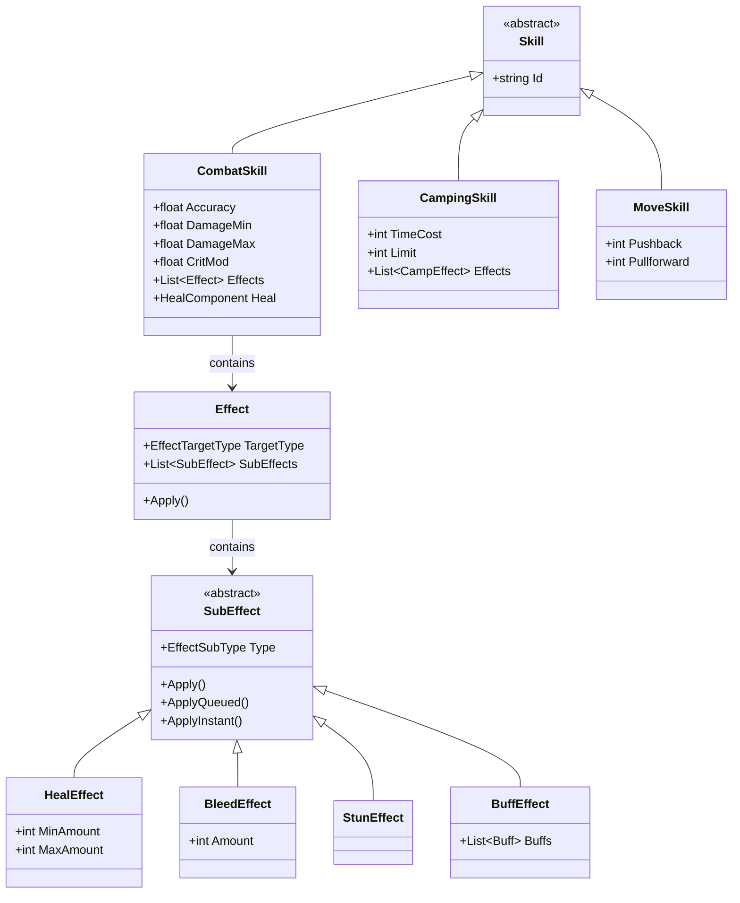
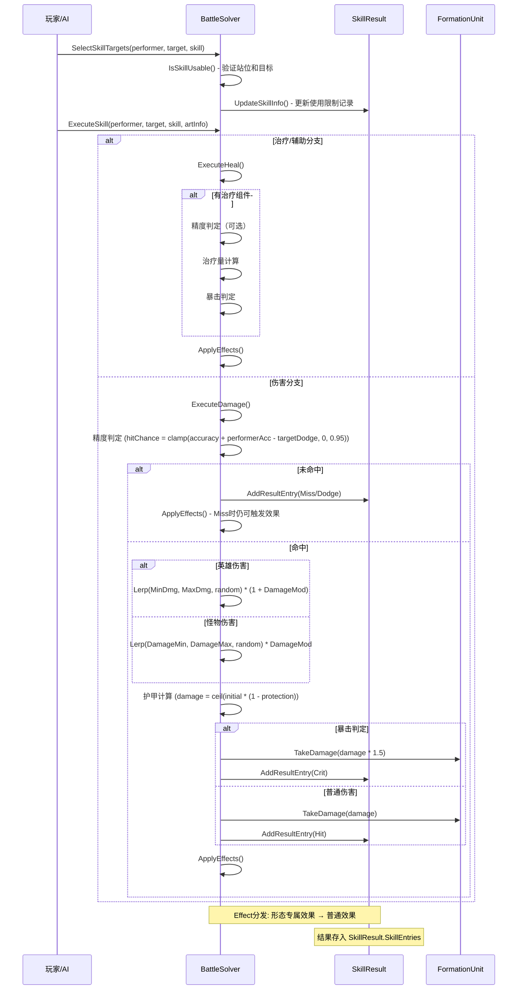
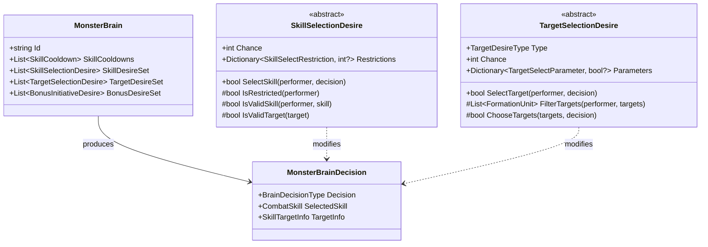
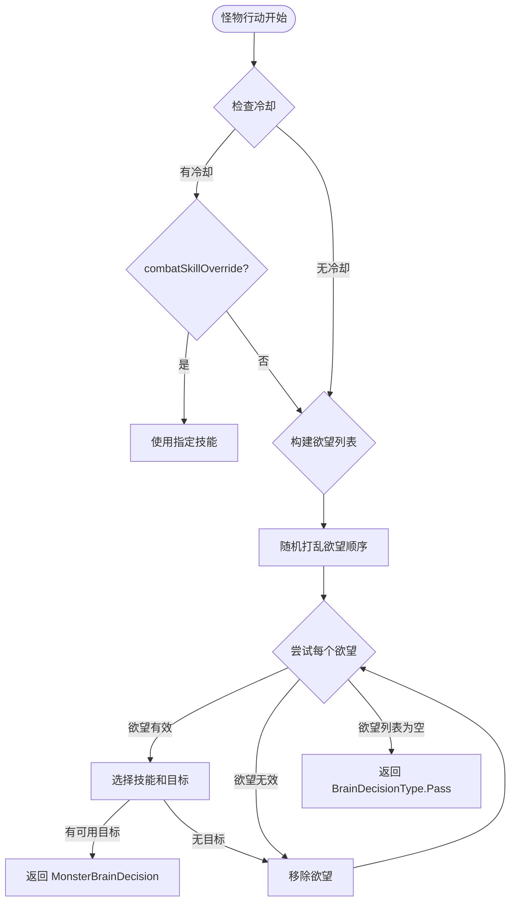

# 技能系统深度技术文档 (Skill System Architecture)

> **What/How/Why 解析法说明**
> - **What**: 该系统/组件是什么，解决什么问题
> - **How**: 具体实现机制与数据流
> - **Why**: 设计决策的背景与权衡

本系统采用**数据驱动 (Data-Driven)** 设计，核心逻辑在于将技能的定义参数与其实际的战斗结算高度解耦。通过一套健壮的指令词解析引擎（Token Parser）和战斗结算器（`BattleSolver`），所有机制均实现了可配置化和灵活扩展。

---

## 目录

1. [核心数据结构](#1-核心数据结构)
2. [技能解析流程](#2-技能解析流程)
3. [技能执行流程](#3-技能执行流程)
4. [效果叠加机制](#4-效果叠加机制)
5. [伤害计算流程](#5-伤害计算流程)
6. [AI 技能选择机制（Skill Desires 系统）](#6-ai-技能选择机制skill-desires-系统)
7. [冷却与限制系统](#7-冷却与限制系统)
8. [ CampingSkill 与 CombatSkill 的区别与共用逻辑](#8-campingskill-与-combatskill-的区别与共用逻辑)
9. [调试/日志基础设施](#9-调试日志基础设施)
10. [实战设计示例](#10-实战设计示例)

---

## 1. 核心数据结构

### 1.0 技能系统整体架构



---

### 1.1 技能抽象基类 `Skill`

```csharp
public abstract class Skill
{
    public string Id { get; set; }
}
```

**What:** 技能抽象基类，所有技能类型（CombatSkill、MoveSkill、CampingSkill）都继承自此。

**How:**
- 仅包含技能唯一标识 `Id`
- 子类通过继承扩展各自的功能域

**Why:** 提供统一的类型识别基础，使技能系统可以泛化处理不同技能类型。

---

### 1.2 战斗技能 `CombatSkill`

**What:** 战斗中最核心的技能类型，负责伤害、治疗、效果施加等战斗行为。

**How:**

**核心属性分类：**

| 类别 | 属性 | 说明 |
|------|------|------|
| **伤害属性** | `Accuracy`, `DamageMin`, `DamageMax`, `DamageMod`, `CritMod` | 精度、伤害区间、伤害修正、暴击修正 |
| **目标属性** | `LaunchRanks`, `TargetRanks` | 施法者站位限制、技能打击位置 |
| **能力标志** | `IsCritValid`, `IsSelfValid`, `CanMiss` | 是否可暴击、是否可对自己生效、是否可能未命中 |
| **效果组件** | `Effects`, `ModeEffects` | 技能附带的特效列表（普通效果、形态专属效果） |
| **辅助组件** | `Heal`, `Move` | 治疗组件、位移组件 |
| **使用限制** | `LimitPerTurn`, `LimitPerBattle`, `IsContinueTurn` | 每回合/每战斗次数限制、是否继续行动 |

> **CritMod 格式约定说明：**
> - **伤害系暴击率**：`CritMod` 为**小数**（如 `0.05` 表示 5%），在数据解析时已除以 100，直接相加到 `performer.CritChance` 即可
> - **治疗系暴击率**：`CritMod` 为**百分数**（如 `5` 表示 5%），需要额外除以 100 转换，即 `skill.CritMod / 100`

```csharp
public class CombatSkill : Skill
{
    public int Level { get; private set; }
    public string Type { get; private set; }
    public SkillCategory Category { get; private set; }

    public float Accuracy { get; private set; }
    public float DamageMin { get; private set; }
    public float DamageMax { get; private set; }
    public float DamageMod { get; private set; }
    public float CritMod { get; private set; }

    public bool IsCritValid { get; private set; }
    public bool IsSelfValid { get; private set; }
    public bool IsGenerationGuaranteed { get; private set; }
    public bool? IsKnowledgeable { get; private set; }
    public bool? CanMiss { get; private set; }
    public float ExtraTargetsChance { get; private set; }

    public HealComponent Heal { get; private set; }
    public MoveComponent Move { get; private set; }
    public List<Effect> Effects { get; private set; }
    public FormationSet LaunchRanks { get; private set; }
    public FormationSet TargetRanks { get; private set; }

    public List<string> ValidModes { get; private set; }
    public Dictionary<string, List<Effect>> ModeEffects { get; private set; }

    public bool IsContinueTurn { get; private set; }
    public int? LimitPerTurn { get; private set; }
    public int? LimitPerBattle { get; private set; }
}
```

**关键方法：**

```csharp
// 获取可用的目标列表
public List<FormationUnit> GetAvailableTargets(FormationUnit performer, 
    FormationParty friends, FormationParty enemies)

// 检测是否存在可用目标
public bool HasAvailableTargets(FormationUnit performer, 
    FormationParty friends, FormationParty enemies)

// 动态判断是否为增益技能
public bool IsBuffSkill
{
    get
    {
        return Effects.Find(effect => effect.SubEffects.Find(subEffect =>
            subEffect.Type == EffectSubType.Buff || 
            subEffect.Type == EffectSubType.StatBuff) != null) != null;
    }
}
```

**Why:**
- `Category` 属性（Damage/Heal/Support）由构造函数在解析完数据后自动推断，当 `Accuracy == 0` 或目标为友方时自动归类为治疗/辅助技能
- `ModeEffects` 支持多形态角色（如 Abomination 的 human/beast 形态）拥有不同的效果集

---

### 1.3 效果系统 `Effect`

**What:** 技能实际产生效果的容器，支持多种布尔/整数参数配置和子效应列表。

**How:**

```csharp
public class Effect
{
    public string Name { get; private set; }
    public EffectTargetType TargetType { get; private set; }  // 作用目标类型
    public Dictionary<EffectBoolParams, bool?> BooleanParams { get; private set; }  // 布尔参数
    public Dictionary<EffectIntParams, int?> IntegerParams { get; private set; }    // 整数参数
    public List<SubEffect> SubEffects { get; private set; }  // 子效应列表
}
```

**布尔参数 (`EffectBoolParams`)：**
- `OnHit` - 是否在命中时触发
- `OnMiss` - 是否在未命中时触发
- `ApplyOnce` - 是否仅应用一次（对同一目标）
- `CanApplyAfterDeath` - 死亡后是否仍可应用
- `CritDoesntApplyToRoll` - 暴击是否不应用于投点
- `ApplyWithResult` - 是否附带技能结果
- `Queue` - 是否进入事件队列（延迟应用）

**目标类型 (`EffectTargetType`)：**
| 类型 | 说明 | 典型用途 |
|------|------|----------|
| `Target` | 技能主目标 | 大多数伤害/治疗效果 |
| `Performer` | 施法者自身 | 反击、自疗 |
| `PerformersOther` | 施法者所在队伍的其他成员 | 群体增益 |
| `TargetGroup` | 目标所在队伍的全部成员 | AOE 效果 |
| `Global` | 全局效果 | 火把值变化 |

---

### 1.4 子效应抽象 `SubEffect`

**What:** 具体效果的抽象基类，每种效果（流血、中毒、眩晕等）都是 `SubEffect` 的子类。

**How:**

```csharp
public abstract class SubEffect
{
    public abstract EffectSubType Type { get; }
    public virtual bool Fusable { get { return false; } }  // 是否可融合

    public virtual void Apply(FormationUnit performer, FormationUnit target, Effect effect);
    public abstract bool ApplyQueued(FormationUnit performer, FormationUnit target, Effect effect);
    public abstract bool ApplyInstant(FormationUnit performer, FormationUnit target, Effect effect);
}
```

**常见子效应实现：**

| 子效应类 | `EffectSubType` | 功能说明 |
|----------|-----------------|----------|
| `BleedEffect` | Bleeding | 流血 DoT，每回合造成伤害 |
| `PoisonEffect` | Poison | 中毒 DoT |
| `StressEffect` | Stress | 压力伤害（可融合） |
| `StunEffect` | Stun | 眩晕，使目标跳过行动 |
| `HealEffect` | Heal | 治疗 |
| `PushEffect` | Push | 击退（整数参数表示格数） |
| `PullEffect` | Pull | 拉近 |
| `GuardEffect` | GuardAlly | 护盾/保护 |
| `BuffEffect` | Buff | 施加 Buff |
| `CombatStatBuffEffect` | StatBuff | 属性修正（护甲、速度等） |
| `RiposteEffect` | Riposte | 反击（攻击后自动反击） |
| `ImmobilizeEffect` | Immobilize |  immobilize 定身 |
| `DiseaseEffect` | Disease | 疾病 |
| `TagEffect` | Tag | 标记 |
| `KillEffect` | Kill | 立即击杀 |
| `CaptureEffect` | Capture | 捕获（APC 特有） |
| `SummonMonstersEffect` | Summon | 召唤怪物 |

**排队机制 (Queue)：**

```csharp
public virtual void Apply(FormationUnit performer, FormationUnit target, Effect effect)
{
    if (effect.BooleanParams[EffectBoolParams.Queue] == false)
        ApplyInstant(performer, target, effect);  // 立即应用
    else
        target.EventQueue.Add(new EffectEvent(performer, target, effect, this));  // 排队
}
```

**Why:** 排队机制确保特效迸发时的动画或数据表现不会死锁，按序播放表现层动画并结算实质伤害。

**可融合效果 (Fusable)：**

```csharp
public override bool Fusable { get { return true; } }

// 融合多个同类型压力伤害
public override int Fuse(FormationUnit performer, FormationUnit target, Effect effect)
{
    float initialDamage = StressAmount;
    initialDamage *= (1 + performer.Character.GetSingleAttribute(AttributeType.StressDmgPercent).ModifiedValue);
    int damage = Mathf.RoundToInt(initialDamage * (1 + 
        target.Character.GetSingleAttribute(AttributeType.StressDmgReceivedPercent).ModifiedValue));
    if (damage < 1) damage = 1;
    return damage;
}
```

---

### 1.5 辅助组件

```csharp
// 治疗组件
public class HealComponent
{
    public int MinAmount { get; set; }
    public int MaxAmount { get; set; }

    public HealComponent(int min, int max)
    {
        MinAmount = min;
        MaxAmount = max;
    }
}

// 位移组件
public class MoveComponent
{
    public int Pushback { get; set; }   // 推后格数
    public int Pullforward { get; set; } // 拉前格数

     public MoveComponent(int push, int pull)
     {
        Pushback = push;
        Pullforward = pull;
     }
}
```

---

### 1.6 站位定义 `FormationSet`

**What:** 解析和处理站位字符串的核心类，用于判断技能是否可从某位置施放、是否可命中某目标。

**How:**

```csharp
public class FormationSet
{
    public bool IsMultitarget { get; private set; }   // 是否AOE（~前缀）
    public bool IsRandomTarget { get; private set; } // 是否随机目标（?前缀）
    public bool IsSelfFormation { get; private set; } // 是否友方目标（@前缀）
    public bool IsSelfTarget { get; private set; }    // 是否对自己施放（空字符串）
    public List<int> Ranks { get; private set; }      // 站位编号列表

    public bool IsLaunchableFrom(int rank, int size);  // 检测施法者站位
    public bool IsTargetableUnit(FormationUnit unit);   // 检测目标是否在范围内
}
```

**站位字符串解析规则：**

| 前缀 | 含义 | 示例 |
|------|------|------|
| 无 | 敌方目标 | `12` - 打击敌方位置1和位置2 |
| `~` | AOE（对该位置所有单位生效） | `~12` - 打击位置1和2的所有单位 |
| `@` | 友方目标 | `@12` - 以友方位置1和2为目标 |
| `?` | 随机目标 | `?3` - 随机选择位置3 |
| 组合 | 可组合使用 | `@~12` - 对友方位置1和2全体施放 |

**示例：**
```text
.launch 12      # 施法者必须在位置1或2
.target ~12      # 打击敌方位置1和2的全部单位（AOE）
.target @3       # 以友方位置3为目标
```

---

### 1.7 技能结果容器

#### SkillResult

**What:** 技能执行结果的全局容器，贯穿整个技能执行流程。

**How:**

```csharp
public class SkillResult
{
    public CombatSkill Skill { get; set; }
    public SkillArtInfo ArtInfo { get; set; }
    public SkillResultEntry Current { get; set; }
   
    public bool HasHit { get; set; }
    public bool HasZeroHealth { get; set; }
    public List<Effect> AppliedEffects { get; private set; }
    public List<SkillResultEntry> SkillEntries { get; private set; }

    public bool HasCritEffect
{
    get
    {
        for (int i = 0; i < SkillEntries.Count; i++)
            if (SkillEntries[i].Type == SkillResultType.Crit && SkillEntries[i].CanCritReleaf)
                return true;
        return false;
    }
}  // 是否有暴击减压效果
    public bool HasDeadEffect { get; }  // 是否有击杀减压效果
}
```

**关键属性说明：**
- `Current` - 当前正在处理的结果条目
- `HasHit` - 是否有命中（不包括 Miss/Dodge）
- `HasZeroHealth` - 是否有单位被击杀
- `AppliedEffects` - 已应用的效果列表（用于 `ApplyOnce` 检测）

#### SkillResultEntry

**What:** 单个目标的技能执行结果条目。

**How:**

```csharp
public class SkillResultEntry
{
    public int Amount { get; set; }              // 伤害/治疗数值
    public bool IsZeroed { get; set; }           // 目标是否被击杀
    public bool IsTargetHit { get; set; }       // 目标是否被命中
    public bool IsHarmful { get; set; }         // 是否为有害结果
    public bool CanCritReleaf { get; set; }      // 是否可暴击减压
    public bool CanKillReleaf { get; set; }     // 是否可击杀减压
    public SkillResultType Type { get; set; }    // 结果类型
    public FormationUnit Target { get; set; }   // 目标单位
}
```

**SkillResultType 枚举：**

```csharp
public enum SkillResultType
{
    Hit,      // 普通命中
    Miss,     // 未命中
    Crit,     // 暴击
    Dodge,    // 闪避
    Heal,     // 治疗
    CritHeal, // 暴击治疗
    Utility   // utility（无伤害/治疗，如 Buff）
}
```

**构造函数重载：**
```csharp
// 无数值结果（Miss/Dodge/Utility）
public SkillResultEntry(FormationUnit target, SkillResultType result)

// 有数值结果（Hit/Crit/Heal/CritHeal）
public SkillResultEntry(FormationUnit target, int skillDamage, SkillResultType result)

// 有数值+击杀标记
public SkillResultEntry(FormationUnit target, int skillDamage, bool isTargetZeroed, SkillResultType result)
```

#### SkillTargetInfo

**What:** 技能目标选择结果，包含目标列表和目标类型。

**How:**

```csharp
public class SkillTargetInfo
{
    public List<FormationUnit> Targets { get; set; }
    public SkillTargetType Type { get; set; }

    public CharacterMode Mode { get; private set; }
    public CombatSkill Skill { get; private set; }
    public SkillArtInfo SkillArtInfo { get; private set; }

    // 更新技能使用记录（每战斗/每回合限制）
    public SkillTargetInfo UpdateSkillInfo(FormationUnit performer, CombatSkill skill);
}
```

---

## 2. 技能解析流程

### 2.1 数据文件格式

技能定义以 `.bytes` 或 `.txt` 文件存储，示例（Leper 的 chop 技能）：

```
combat_skill: .id "chop" .level 0 .type "melee" .atk 75% .dmg 0% .crit 2% 
              .launch 12 .target 12 .is_crit_valid True .generation_guaranteed true
```

### 2.2 CombatSkill Token 解析详解

```csharp
private void LoadData(List<string> data, bool isHeroSkill)
{
    for (int i = 1; i < data.Count; i++)
    {
        switch (data[i])
        {
            case ".id":
                Id = data[++i];
                break;
            case ".atk":
                Accuracy = float.Parse(data[++i]) / 100;
                break;
            case ".dmg":
                if (isHeroSkill)
                    DamageMod = float.Parse(data[++i]) / 100;
                else
                {
                    DamageMin = float.Parse(data[++i]);
                    DamageMax = float.Parse(data[++i]);
                }
                break;
            case ".launch":
                LaunchRanks = new FormationSet(data[++i]);
                break;
            case ".target":
                if (++i < data.Count && data[i--][0] != '.')
                    TargetRanks = new FormationSet(data[++i]);
                else
                    TargetRanks = new FormationSet("");
                break;
            case ".effect":
                while (++i < data.Count && data[i--][0] != '.')
                {
                    if (DarkestDungeonManager.Data.Effects.ContainsKey(data[++i]))
                        Effects.Add(DarkestDungeonManager.Data.Effects[data[i]]);
                }
                break;
            case ".valid_modes":
                while (++i < data.Count && data[i--][0] != '.')
                    ValidModes.Add(data[++i]);
                break;
            case ".human_effects":
                var humanEffects = new List<Effect>();
                ModeEffects.Add("human", humanEffects);
                while (++i < data.Count && data[i--][0] != '.')
                    if (DarkestDungeonManager.Data.Effects.ContainsKey(data[++i]))
                        humanEffects.Add(DarkestDungeonManager.Data.Effects[data[i]]);
                break;
            case ".beast_effects":
                var beastEffects = new List<Effect>();
                ModeEffects.Add("beast", beastEffects);
                while (++i < data.Count && data[i--][0] != '.')
                    if (DarkestDungeonManager.Data.Effects.ContainsKey(data[++i]))
                        beastEffects.Add(DarkestDungeonManager.Data.Effects[data[i]]);
                break;
            // ... 其他 Token
        }
    }

    // 推断技能类别
    if (Accuracy == 0 || TargetRanks.IsSelfFormation || TargetRanks.IsSelfTarget)
    {
        if (Heal == null)
            Category = SkillCategory.Support;
        else
            Category = SkillCategory.Heal;
    }
}
```

### 2.3 Effect 解析流程

效果在 `Effects.txt` 中定义：

```
effect: .name "Push 3A" .target "target" .push 3 .chance 100% 
        .on_hit true .on_miss false .can_apply_on_death true
```

```csharp
private void LoadData(List<string> data)
{
    for (int i = 1; i < data.Count; i++)
    {
        switch (data[i])
        {
            case ".push":
                SubEffects.Add(new PushEffect(int.Parse(data[++i])));
                break;
            case ".stun":
                SubEffects.Add(new StunEffect());
                break;
            case ".dotBleed":
                SubEffects.Add(new BleedEffect(int.Parse(data[++i])));
                break;
            case ".stress":
                SubEffects.Add(new StressEffect(int.Parse(data[++i])));
                break;
            case ".buff_ids":
                BuffEffect buffEffect = new BuffEffect();
                while (++i < data.Count && data[i--][0] != '.')
                    if (DarkestDungeonManager.Data.Buffs.ContainsKey(data[++i]))
                        buffEffect.Buffs.Add(DarkestDungeonManager.Data.Buffs[data[i]]);
                SubEffects.Add(buffEffect);
                break;
            case ".combat_stat_buff":
                statEffect = new CombatStatBuffEffect();
                // 解析 .protection_rating_add, .speed_rating_add 等
                SubEffects.Add(statEffect);
                break;
            case ".riposte":
                riposteEffect = new RiposteEffect();
                // 解析 .riposte_chance_add
                SubEffects.Add(riposteEffect);
                break;
            // ... 其他子效应
        }
    }
}
```

---

## 3. 技能执行流程

### 3.1 入口：`BattleSolver.ExecuteSkill`

```csharp
public static void ExecuteSkill(FormationUnit performerUnit, FormationUnit targetUnit, 
    CombatSkill skill, SkillArtInfo artInfo)
{
    // 1. 初始化结果容器
    SkillResult.Skill = skill;
    SkillResult.ArtInfo = artInfo;

    var target = targetUnit.Character;
    var performer = performerUnit.Character;

    // 2. 应用临时条件（Buff规则）
    ApplyConditions(performerUnit, targetUnit, skill);

    // 3. 处理强制位移
    if (skill.Move != null && !performerUnit.CombatInfo.IsImmobilized)
    {
        if (skill.Move.Pullforward > 0)
            performerUnit.Pull(skill.Move.Pullforward, false);
        else if (skill.Move.Pushback > 0)
            performerUnit.Push(skill.Move.Pushback, false);
    }

    // 4. 分支：治疗/辅助 vs 伤害
    if (skill.Category == SkillCategory.Heal || skill.Category == SkillCategory.Support)
    {
        ExecuteHeal(performerUnit, targetUnit, skill);
    }
    else
    {
        ExecuteDamage(performerUnit, targetUnit, skill);
    }
}
```

### 3.2 执行链路图



---

## 4. 效果叠加机制

### 4.1 效果分发入口

```csharp
public static void ApplyEffects(FormationUnit performerUnit, FormationUnit targetUnit, CombatSkill skill)
{
    // 1. 处理形态专属效果（如人/兽形态）
    if(skill.ValidModes.Count > 1 && performerUnit.Character.Mode != null)
        foreach (var effect in skill.ModeEffects[performerUnit.Character.Mode.Id])
            effect.Apply(performerUnit, targetUnit, SkillResult);

    // 2. 处理技能基础效果
    foreach (var effect in skill.Effects)
        effect.Apply(performerUnit, targetUnit, SkillResult);
}
```

### 4.2 Effect.Apply() 执行流程

```csharp
public void Apply(FormationUnit performer, FormationUnit target, SkillResult skillResult)
{
    // 1. 检测是否已应用过（apply_once）
    if (BooleanParams[EffectBoolParams.ApplyOnce].Value == true)
        if (skillResult.AppliedEffects.Contains(this))
            return;

    // 2. 检测未命中/闪避跳过
    if (BooleanParams[EffectBoolParams.OnMiss] == false)
        if (skillResult.Current.Type == SkillResultType.Miss || 
            skillResult.Current.Type == SkillResultType.Dodge)
            return;

    // 3. 检测死亡后是否可应用
    if (BooleanParams[EffectBoolParams.CanApplyAfterDeath] == false)
        if (skillResult.Current.IsZeroed)
            return;

    // 4. 根据目标类型分发
    switch(TargetType)
    {
        case EffectTargetType.Target:
            foreach (var subEffect in SubEffects)
                subEffect.Apply(performer, target, this);
            break;
        case EffectTargetType.Performer:
            foreach (var subEffect in SubEffects)
                subEffect.Apply(performer, performer, this);
            break;
        case EffectTargetType.PerformersOther:
            foreach(var unit in performer.Party.Units)
                if(unit != performer)
                    foreach (var subEffect in SubEffects)
                        subEffect.Apply(performer, unit, this);
            break;
        case EffectTargetType.TargetGroup:
            foreach(var unit in target.Party.Units)
                foreach (var subEffect in SubEffects)
                    subEffect.Apply(performer, unit, this);
            break;
        case EffectTargetType.Global:
            // 处理火把值变化
            if(IntegerParams[EffectIntParams.Torch].HasValue)
                RaidSceneManager.TorchMeter.AdjustTorch(IntegerParams[EffectIntParams.Torch].Value);
            foreach (var subEffect in SubEffects)
                subEffect.Apply(performer, target, this);
            break;
    }

    skillResult.AppliedEffects.Add(this);
}
```

---

## 5. 伤害计算流程

### 5.1 完整伤害结算流程

```csharp
private static void ExecuteDamage(FormationUnit performerUnit, FormationUnit targetUnit, CombatSkill skill)
{
    var target = targetUnit.Character;
    var performer = performerUnit.Character;

    // ===== 第一步：精度判定 =====
    float accuracy = skill.Accuracy + performer.Accuracy;
    float hitChance = Mathf.Clamp(accuracy - target.Dodge, 0, 0.95f);
    float roll = (float)RandomSolver.NextDouble();

    // 检测不可被命中
    if (target.BattleModifiers != null && target.BattleModifiers.CanBeHit == false)
        roll = float.MaxValue;

    if (roll > hitChance)
    {
        if (!(skill.CanMiss == false || 
              (target.BattleModifiers != null && target.BattleModifiers.CanBeMissed == false)))
        {
            if (roll > Mathf.Min(accuracy, 0.95f))
                SkillResult.AddResultEntry(new SkillResultEntry(targetUnit, SkillResultType.Miss));
            else
                SkillResult.AddResultEntry(new SkillResultEntry(targetUnit, SkillResultType.Dodge));

            ApplyEffects(performerUnit, targetUnit, skill);  // Miss时仍可触发效果
            return;
        }
    }

    // ===== 第二步：伤害投点 =====
    float initialDamage;
    if (performer is Hero)
    {
        // 英雄：从角色属性计算伤害区间
        initialDamage = Mathf.Lerp(performer.MinDamage, performer.MaxDamage, 
            (float)RandomSolver.NextDouble()) * (1 + skill.DamageMod);
    }
    else
    {
        // 怪物：从技能定义计算
        initialDamage = Mathf.Lerp(skill.DamageMin, skill.DamageMax, 
            (float)RandomSolver.NextDouble()) * performer.DamageMod;
    }

    // ===== 第三步：护甲计算 =====
    int damage = Mathf.CeilToInt(initialDamage * (1 - target.Protection));
    if (damage < 0) damage = 0;

    // 检测是否可直接伤害
    if (target.BattleModifiers != null && target.BattleModifiers.CanBeDamagedDirectly == false)
        damage = 0;

    // ===== 第四步：暴击判定 =====
    if (skill.IsCritValid)
    {
        float critChance = performer.GetSingleAttribute(AttributeType.CritChance).ModifiedValue + skill.CritMod;
        if (RandomSolver.CheckSuccess(critChance))
        {
            int critDamage = target.TakeDamage(damage * 1.5f);  // 暴击伤害1.5倍
            SkillResult.AddResultEntry(new SkillResultEntry(targetUnit, critDamage, SkillResultType.Crit));

            ApplyEffects(performerUnit, targetUnit, skill);

            // 英雄暴击触发全队减压
            if (targetUnit.Character.IsMonster == false)
                DarkestDungeonManager.Data.Effects["Stress 2"].ApplyIndependent(targetUnit);
            return;
        }
    }

    // ===== 第五步：正常伤害结算 =====
    damage = target.TakeDamage(damage);
    SkillResult.AddResultEntry(new SkillResultEntry(targetUnit, damage, SkillResultType.Hit));
    ApplyEffects(performerUnit, targetUnit, skill);
}
```

### 5.2 伤害计算公式汇总

| 计算步骤 | 公式 | 说明 |
|----------|------|------|
| **命中判定** | `hitChance = Clamp(SkillAccuracy + PerformerAccuracy - TargetDodge, 0, 0.95)` | 上限95% |
| **英雄伤害** | `Lerp(MinDmg, MaxDmg, random) * (1 + DamageMod)` | 区间内插值 |
| **怪物伤害** | `Lerp(DamageMin, DamageMax, random) * DamageMod` | 使用技能固定区间 |
| **护甲减免** | `damage = CeilToInt(initialDamage * (1 - Protection))` | 向上取整；`target.Protection` 为 0-1 小数值（如 0.25 表示 25% 减免） |
| **暴击伤害** | `damage * 1.5` | 固定1.5倍系数 |

### 5.3 治疗计算流程

```csharp
if (skill.Heal != null)
{
    // 基础治疗量
    float initialHeal = RandomSolver.Next(skill.Heal.MinAmount, skill.Heal.MaxAmount + 1) *
        (1 + performer.GetSingleAttribute(AttributeType.HpHealPercent).ModifiedValue);

    // 暴击治疗（1.5倍）
    if (skill.IsCritValid)
    {
        // skill.CritMod 为百分数格式（如 5 表示 5%），需要除以 100 转换
        float critChance = performer[AttributeType.CritChance].ModifiedValue + skill.CritMod / 100;
        if (RandomSolver.CheckSuccess(critChance))
        {
            int critHeal = target.Heal(initialHeal * 1.5f, true);
            SkillResult.AddResultEntry(new SkillResultEntry(targetUnit, critHeal, SkillResultType.CritHeal));
            // 暴击治疗触发全队减压
            DarkestDungeonManager.Data.Effects["crit_heal_stress_heal"].ApplyIndependent(targetUnit);
            return;
        }
    }

    int heal = target.Heal(initialHeal, true);
    SkillResult.AddResultEntry(new SkillResultEntry(targetUnit, heal, SkillResultType.Heal));
}
```

---

## 6. AI 技能选择机制（Skill Desires 系统）

**What:** 怪物 AI 通过 Skill Desires 系统实现灵活的技能和目标选择。该系统采用**欲望驱动**（Desire-based）的设计，每个 Desire 代表一种选择倾向，通过权重随机抽签决定最终决策。

### 6.1 核心架构



### 6.2 SkillSelectionDesire 体系

**What:** 技能选择欲望，决定怪物何时（If）以及多大可能选择某个技能。

**How:**

```csharp
public abstract class SkillSelectionDesire : IProportionValue
{
    public virtual int Chance { get; set; }  // 基础权重

    private readonly Dictionary<SkillSelectRestriction, int?> restrictions;

    public bool SelectSkill(FormationUnit performer, MonsterBrainDecision decision)
    {
        // 1. 检测全局限制
        if (IsRestricted(performer))
            return false;

        var monster = (Monster)performer.Character;
        // 2. 筛选可用技能
        var availableSkills = monster.Data.CombatSkills
            .FindAll(skill => IsValidSkill(performer, skill));

        if (availableSkills.Count > 0)
        {
            decision.Decision = BrainDecisionType.Perform;
            decision.SelectedSkill = availableSkills[RandomSolver.Next(availableSkills.Count)];
            decision.TargetInfo.Targets = BattleSolver.GetSkillAvailableTargets(...);
            
            // 3. 目标选择
            var availableTargetDesires = monster.Brain.TargetDesireSet
                .FindAll(IsValidTargetDesire);
            while (availableTargetDesires.Count > 0)
            {
                TargetSelectionDesire desire = RandomSolver.ChooseByRandom(availableTargetDesires);
                if (desire.SelectTarget(performer, decision))
                    return true;
                availableTargetDesires.Remove(desire);
            }
            return false;
        }
        return false;
    }

    protected virtual bool IsValidSkill(FormationUnit performer, CombatSkill skill)
    {
        // 检测冷却
        if (performer.CombatInfo.SkillCooldowns.Any(cooldown => cooldown.SkillId == skill.Id))
            return false;
        return BattleSolver.IsSkillUsable(performer, skill);
    }
}
```

**限制条件 (`SkillSelectRestriction`)：**

| 限制类型 | 说明 |
|----------|------|
| `MonstersMin/MonstersMax` | 场上怪物数量范围 |
| `MonstersSizeMin/MonstersSizeMax` | 怪物总大小范围 |
| `MarkedHeroesMin/MarkedHeroesMax` | 被标记英雄数量范围 |
| `NonVirtuedHeroesMin` | 非virtue英雄最小数量 |
| `VirtuedHeroesMax` | Virtue英雄最大数量 |
| `ControlCountMin/ControlCountMax` | 控制效果数量范围 |
| `HeroesMin` | 英雄最小数量 |
| `GuardedMonstersMin/GuardedMonstersMax` | 被保护的怪物数量范围 |

**SkillSelectionDesire 子类实现：**

| 类名 | 功能说明 |
|------|----------|
| `SkillSelectionRandom` | 随机选择可用技能 |
| `SkillSelectionPreferred` | 优先选择特定技能（`PreferableSkill`） |
| `SkillSelectionHeal` | 当目标 HP 低于阈值时选择治疗技能 |
| `SkillSelectionAllyAlive` | 检测友方存活数量后选择 |
| `SkillSelectionAllyDead` | 检测友方死亡数量后选择 |
| `SkillSelectionStatus` | 基于目标状态选择技能 |
| `SkillSelectionPerformingTurn` | 基于当前回合状态选择 |
| `SkillSelectionFillEmptyCaptor` | 填充空捕获槽位 |

**示例 - SkillSelectionHeal：**

```csharp
public sealed class SkillSelectionHeal : SkillSelectionDesire
{
    private string CombatSkillId { get; set; }
    private float HpRatioThreshold { get; set; }
    private bool FirstInitiativeOnly { get; set; }

    protected override bool IsValidTarget(FormationUnit target)
    {
        return target.Character.HealthRatio < HpRatioThreshold;  // HP比例低于阈值
    }

    protected override bool IsValidTargetDesire(TargetSelectionDesire desire)
    {
        return desire.Type == TargetDesireType.Health;  // 配合 Health 目标欲望
    }
}
```

### 6.3 TargetSelectionDesire 体系

**What:** 目标选择欲望，决定 AI 选择哪个具体目标。

**How:**

```csharp
public abstract class TargetSelectionDesire : IProportionValue
{
    public TargetDesireType Type { get; protected set; }
    public int Chance { get; set; }

    public virtual bool SelectTarget(FormationUnit performer, MonsterBrainDecision decision)
    {
        // 检测特定技能限制
        if (!(SpecificCombatSkillId == "" || SpecificCombatSkillId == decision.SelectedSkill.Id))
            return false;

        // 检测目标类型限制
        if (decision.SelectedSkill.TargetRanks.IsSelfFormation && !IsFriendlyTargetDesire)
            return false;

        return ChooseTargets(FilterTargets(performer, decision.TargetInfo.Targets), decision);
    }

    protected virtual List<FormationUnit> FilterTargets(FormationUnit performer, 
        List<FormationUnit> possibleTargets)
    {
        var availableTargets = new List<FormationUnit>(possibleTargets);

        // 根据参数过滤
        if (Parameters[TargetSelectParameter.CanTargetDeathsDoor] == false)
            availableTargets.RemoveAll(unit => unit.Character.AtDeathsDoor);

        if (Parameters[TargetSelectParameter.CanTargetLastHero] == false)
            availableTargets.RemoveAll(unit => 
                performer.CombatInfo.LastCombatSkillTarget == unit.CombatInfo.CombatId);

        if (Parameters[TargetSelectParameter.CanTargetNotOverstressed] == false)
            availableTargets.RemoveAll(unit => !unit.Character.IsOverstressed);

        if (Parameters[TargetSelectParameter.CanTargetAfflicted] == false)
            availableTargets.RemoveAll(unit => unit.Character.IsAfflicted);

        return availableTargets;
    }

    protected virtual bool ChooseTargets(List<FormationUnit> availableTargets, 
        MonsterBrainDecision decision)
    {
        if (availableTargets.Count > 0)
        {
            decision.TargetInfo.Targets.Clear();

            if (decision.SelectedSkill.TargetRanks.IsMultitarget)
            {
                decision.TargetInfo.Targets.AddRange(availableTargets);
                return true;
            }
            else
            {
                // 随机选择单一目标
                int index = Random.Range(0, availableTargets.Count);
                decision.TargetInfo.Targets.Add(availableTargets[index]);
                
                // 额外目标概率
                if (decision.SelectedSkill.ExtraTargetsChance > 0 && availableTargets.Count > 1 &&
                    RandomSolver.CheckSuccess(decision.SelectedSkill.ExtraTargetsChance))
                {
                    int sideTargetIndex = Random.Range(0, availableTargets.Count - 1);
                    decision.TargetInfo.Targets.Add(availableTargets[sideTargetIndex]);
                }
                return true;
            }
        }
        return false;
    }
}
```

**TargetSelectionDesire 子类实现：**

| 类名 | 功能说明 |
|------|----------|
| `TargetSelectionRandom` | 随机选择目标 |
| `TargetSelectionHealth` | 选择 HP 最低/最高的目标 |
| `TargetSelectionStress` | 选择压力最高的目标 |
| `TargetSelectionRank` | 选择特定位置的目标 |
| `TargetSelectionAllyClass` | 选择特定职业的友方 |
| `TargetSelectionMarked` | 选择被标记的目标 |
| `TargetSelectionResistance` | 选择抗性最低的目标 |
| `TargetSelectionFillCaptor` | 填充捕获槽 |

### 6.4 AI 决策流程图



### 6.5 技能选择示例 - 怪物治疗

```csharp
// SkillSelectionHeal 欲望配置示例 (JSON)
{
    "base_chance": 100,
    "hp_ratio_treshold": 0.5,        // HP低于50%时触发
    "first_initiative_only": true,   // 仅在先手回合可用
    "combat_skill_id": "heal"         // 指定治疗技能ID
}
```

---

## 7. 冷却与限制系统

**What:** 技能使用限制系统，包括每战斗限制（`LimitPerBattle`）、每回合限制（`LimitPerTurn`）和冷却时间（`SkillCooldown`）。

### 7.1 使用限制

**How:**

在 `CombatSkill` 中定义：
```csharp
public bool IsContinueTurn { get; private set; }  // 使用后继续行动
public int? LimitPerTurn { get; private set; }   // 每回合限制次数
public int? LimitPerBattle { get; private set; } // 每战斗限制次数
```

**使用记录存储：**

```csharp
// SkillTargetInfo.UpdateSkillInfo()
public SkillTargetInfo UpdateSkillInfo(FormationUnit performer, CombatSkill skill)
{
    if (skill.LimitPerBattle.HasValue)
        performer.CombatInfo.SkillsUsedInBattle.Add(skill.Id);
    if (skill.LimitPerTurn.HasValue)
        performer.CombatInfo.SkillsUsedThisTurn.Add(skill.Id);
    return this;
}
```

**可用性检测：**

```csharp
public static bool IsSkillUsable(FormationUnit performer, CombatSkill skill)
{
    // 检测站位
    if (!skill.LaunchRanks.IsLaunchableFrom(performer.Rank, performer.Size))
        return false;

    // 检测目标
    if (!skill.HasAvailableTargets(performer, friends, enemies))
        return false;

    // 检测每战斗限制
    if (skill.LimitPerBattle.HasValue)
    {
        int battleUsageCount = performer.CombatInfo.SkillsUsedInBattle
            .Count(id => id == skill.Id);
        if (battleUsageCount >= skill.LimitPerBattle.Value)
            return false;
    }

    // 检测每回合限制
    if (skill.LimitPerTurn.HasValue)
    {
        int turnUsageCount = performer.CombatInfo.SkillsUsedThisTurn
            .Count(id => id == skill.Id);
        if (turnUsageCount >= skill.LimitPerTurn.Value)
            return false;
    }

    return true;
}
```

### 7.2 冷却系统

**What:** 怪物 AI 的技能冷却机制，独立于战斗限制系统。

**How:**

```csharp
public class SkillCooldown
{
    public string SkillId { get; private set; }
    public int Amount { get; private set; }

    public bool ReduceCooldown()
    {
        return --Amount <= 0;  // 返回 true 表示冷却结束
    }

    public SkillCooldown Copy()
    {
        return new SkillCooldown(SkillId, Amount);
    }
}
```

**冷却管理流程：**

```csharp
// UseMonsterBrain() 中的冷却处理
var skillDesires = new List<SkillSelectionDesire>(monster.Brain.SkillDesireSet);

while (skillDesires.Count != 0)
{
    SkillSelectionDesire desire = RandomSolver.ChooseByRandom(skillDesires);
    if (desire != null && desire.SelectSkill(performer, monsterBrainDecision))
    {
        // 应用冷却
        var cooldown = monster.Brain.SkillCooldowns
            .Find(cd => cd.SkillId == monsterBrainDecision.SelectedSkill.Id);
        if (cooldown != null) 
            performer.CombatInfo.SkillCooldowns.Add(cooldown.Copy());
        
        RaidSceneManager.BattleGround.LastSkillUsed = monsterBrainDecision.SelectedSkill.Id;
        return monsterBrainDecision;
    }
    else
        skillDesires.Remove(desire);
}
```

**冷却数据来源：**

冷却信息存储在 AI 数据文件（JSON）中：
```json
{
    "monster_brains": [
        {
            "id": "bone_ballista",
            "skill_cooldowns": [
                { "skill_id": "debuff_skill", "cooldown_amount": 2 }
            ]
        }
    ]
}
```

---

## 8. CampingSkill 与 CombatSkill 的区别与共用逻辑

### 8.1 设计定位对比

| 维度 | CombatSkill | CampingSkill |
|------|-------------|--------------|
| **使用场景** | 战斗（Battle） | 扎营（Camping） |
| **执行方式** | 实时动作 | 时间消耗（Time Cost） |
| **目标选择** | 站位/FormationUnit | CampTargetType（Self/Individual/PartyOther） |
| **效果类型** | 伤害/治疗/状态 | 压力治愈/血量恢复/Buff/移除负面状态 |
| **限制机制** | 每战斗/每回合/LimitPerBattle | Limit（使用次数）/TimeCost |

### 8.2 CampingSkill 数据结构

```csharp
public class CampingSkill : Skill
{
    public int TimeCost { get; set; }        // 时间消耗
    public int Limit { get; set; }          // 限制使用次数

    public bool HasIndividualTarget
    {
        get
        {
            return Effects.Find(effect => effect.Selection == CampTargetType.Individual) != null;
        }
    }

    public List<string> Classes { get; set; }   // 可使用英雄职业
    public List<CampEffect> Effects { get; set; } // 扎营效果列表
    public CurrencyCost CurrencyCost { get; set; } // 消耗资源
}

public class CampEffect : ISingleProportion
{
    public CampTargetType Selection { get; set; }          // 目标类型
    public CampEffectRequirement Requirement { get; set; } // 前置条件
    public CampEffectType Type { get; set; }              // 效果类型
    public string Subtype { get; set; }                   // 子类型（如特定buff）
    public float Amount { get; set; }                     // 数值
    public float Chance { get; set; }                     // 触发概率
    public string Code { get; set; }
}
```

### 8.3 CampEffectType 枚举

```csharp
public enum CampEffectType
{
    None,
    StressHealAmount,           // 压力治愈
    HealthHealMaxHealthPercent,  // 按最大生命值比例治疗
    RemoveBleed,                // 移除流血
    RemovePoison,               // 移除中毒
    Buff,                       // 施加Buff
    RemoveDeathRecovery,        // 移除死亡恢复状态
    ReduceAmbushChance,         // 降低偷袭概率
    RemoveDisease,              // 移除疾病
    StressDamageAmount,         // 压力伤害
    Loot,                       // 战利品
    ReduceTorch,                // 降低火把
    HealthDamageMaxHealthPercent // 按最大生命值比例伤害
}
```

### 8.4 CampEffectRequirement 前置条件

```csharp
public enum CampEffectRequirement
{
    None,
    Religious,        // 虔诚角色
    Nonreligious,     // 非虔诚角色
    Afflicted,        // 被困扰角色
    DeathRecovery     // 处于死亡恢复状态
}
```

### 8.5 CampTargetType 目标类型

```csharp
public enum CampTargetType
{
    None,
    Individual,      // 单体目标
    Self,            // 施法者自身
    PartyOther       // 队伍其他成员（不包括施法者）
}
```

### 8.6 可用性检测

```csharp
public static bool IsCampingSkillUsable(FormationUnit performer, CampingSkill skill)
{
    // 1. 检测使用次数限制
    int skillUsageCount = 0;
    for (int i = 0; i < performer.CombatInfo.SkillsUsedThisTurn.Count; i++)
        if (performer.CombatInfo.SkillsUsedThisTurn[i] == skill.Id)
            skillUsageCount++;

    if (skillUsageCount >= skill.Limit)
        return false;

    // 2. 检测时间消耗
    if (skill.TimeCost > RaidSceneManager.Raid.CampingTimeLeft)
        return false;

    // 3. 检测目标可用性
    for (int i = 0; i < skill.Effects.Count; i++)
    {
        switch (skill.Effects[i].Selection)
        {
            case CampTargetType.Self:
                return true;
            case CampTargetType.Individual:
            case CampTargetType.PartyOther:
                if (RaidSceneManager.HeroParty.Units.Count > 1)
                    return true;
                break;
        }
    }

    return false;
}
```

### 8.7 共用逻辑

虽然 `CampingSkill` 和 `CombatSkill` 是完全独立的类，但它们共享以下设计模式：

| 共用模式 | 说明 |
|----------|------|
| **数据驱动** | 均通过 Token 解析从数据文件加载 |
| **技能限制系统** | `Limit` vs `LimitPerTurn/LimitPerBattle` |
| **Tooltip 生成** | `HeroSkillTooltip()` 方法签名相似 |
| **效果系统** | `CampEffect` 与 `Effect` 有相似的效果施加逻辑 |

---

## 9. 调试/日志基础设施

### 9.1 SkillArtInfo - 技能表现层配置

**What:** 存储技能的可视化信息，用于 UI 显示和动画触发。

**How:**

```csharp
public class SkillArtInfo
{
    public string SkillId { get; private set; }
    public string AnimationId { get; private set; }
    public string ArtId { get; private set; }

    public string IconId { get; private set; }
    public bool? CanDisplaySelection { get; private set; }

    public string TargetFx { get; private set; }       // 目标特效
    public string TargetChestFx { get; private set; }  // 目标胸部特效
    public string TargetHeadFx { get; private set; }   // 目标头部特效

    public Vector2 AreaOffset { get; private set; }          // 区域偏移
    public Vector2 TargetAreaOffset { get; private set; }     // 目标区域偏移
}
```

### 9.2 HeroActionInfo - 技能潜力预览

**What:** 用于 UI 预览技能的预期效果（命中率、暴击率、伤害范围）。

**How:**

```csharp
public class HeroActionInfo
{
    public bool IsValid { get; private set; }
    public float ChanceToHit { get; private set; }
    public float ChanceToCrit { get; private set; }
    public int MinDamage { get; private set; }
    public int MaxDamage { get; private set; }

    public void UpdateInfo(bool valid, float hit, float crit, int minDamage, int maxDamage)
    {
        IsValid = valid;
        ChanceToCrit = crit;
        ChanceToHit = hit;
        MinDamage = minDamage;
        MaxDamage = maxDamage;
    }
}
```

**使用场景：**
- 怪物攻击前显示 Tooltip（显示对英雄的预期伤害）
- 玩家选择技能时显示预期效果

```csharp
public static void CalculateSkillPotential(FormationUnit performerUnit, 
    FormationUnit targetUnit, CombatSkill skill)
{
    // ... 计算逻辑
    HeroActionInfo.UpdateInfo(true, hitChance, critChance, minDamage, maxDamage);
}
```

### 9.3 日志输出点

**错误日志（Debug.LogError）：**

| 位置 | 触发条件 |
|------|----------|
| `CombatSkill.LoadData()` | 未知的 Token 或缺少 Effect |
| `SkillArtInfo.LoadData()` | 未知的 Art Token |
| `Effect.LoadData()` | 解析失败或缺少必需参数 |
| `SkillSelectionDesire.ProcessBaseDataToken()` | 未知的限制条件 Token |
| `TargetSelectionDesire.ProcessBaseDataToken()` | 未知的目标选择 Token |

**格式示例：**
```csharp
Debug.LogError("Missing effect " + effectName + " in skill " + skillId);
Debug.LogError("Unknown token in skill desire: " + token.Key + " Type: " + this);
```

### 9.4 调试建议

1. **技能不生效**：检查 `Effects.txt` 中 effect 是否正确定义
2. **技能不可用**：检查 `LaunchRanks` 和 `TargetRanks` 配置
3. **AI 不选择技能**：检查 `SkillDesireSet` 配置和 `SkillCooldown` 状态
4. **伤害异常**：检查 `BattleModifiers`（`CanBeDamagedDirectly` 等）

---

## 10. 实战设计示例

### 10.1 设计目标：创建"重斩"技能

**设计需求：**
- 对单个敌人造成高伤害
- 附加25%护甲穿透
- 30%几率造成眩晕
- 目标流血3回合，每回合5点伤害

### 10.2 第一步：定义效果（Effects.txt）

```
effect: .name "Heavy Strike Armor Break" .target "target" 
        .protection_rating_add 25
        .on_hit true .queue true

effect: .name "Heavy Strike Stun" .target "target" 
        .stun 1 .chance 30%
        .on_hit true .queue true

effect: .name "Heavy Strike Bleed" .target "target" 
        .dotBleed 5 .duration 3 .chance 100%
        .on_hit true .queue true
```

### 10.3 第二步：定义技能（Hero.bytes）

```
combat_skill: .id "heavy_strike" .level 0 .type "melee" 
              .atk 85% .dmg 50% .crit 5% 
              .launch 12 .target 1 
              .is_crit_valid True
              .effect "Heavy Strike Armor Break" 
              "Heavy Strike Stun" 
              "Heavy Strike Bleed"
```

### 10.4 变身技能设计（Abomination 示例）

```
combat_skill: .id "transform" .level 0 .type "melee" 
              .atk 0% .dmg 0% .crit 0% 
              .launch 12 .target
              .valid_modes human beast
              .human_effects "Abomination Human Heal" "Abomination Human Stress Heal"
              .beast_effects "Abomination Beast Self Damage" "Abomination Beast Party Damage"
```

---

## 附录：关键文件索引

| 文件路径 | 说明 |
|----------|------|
| `Assets/Scripts/Mechanics/Skills/Skill.cs` | 技能抽象基类，包含 HealComponent/MoveComponent |
| `Assets/Scripts/Mechanics/Skills/CombatSkill.cs` | 战斗技能实现，Token 解析 |
| `Assets/Scripts/Mechanics/Skills/CampingSkill.cs` | 扎营技能实现 |
| `Assets/Scripts/Mechanics/Skills/CampingSkillHelper.cs` | 扎营技能辅助函数 |
| `Assets/Scripts/Mechanics/Skills/Effect.cs` | 效果容器，Token 解析 |
| `Assets/Scripts/Mechanics/Skills/SubEffect.cs` | 子效应抽象基类 |
| `Assets/Scripts/Mechanics/Skills/MoveSkill.cs` | 位移技能 |
| `Assets/Scripts/Mechanics/Skills/SkillArtInfo.cs` | 技能表现层配置 |
| `Assets/Scripts/Mechanics/Battle/BattleSolver.cs` | 战斗结算器，技能执行入口 |
| `Assets/Scripts/Mechanics/Battle/SkillResult.cs` | 技能结果容器 |
| `Assets/Scripts/Mechanics/Battle/SkillResultEntry.cs` | 单目标结果条目 |
| `Assets/Scripts/Mechanics/Battle/SkillTargetInfo.cs` | 目标选择信息 |
| `Assets/Scripts/Mechanics/Battle/SkillCooldown.cs` | 技能冷却 |
| `Assets/Scripts/Mechanics/Battle/HeroActionInfo.cs` | 技能潜力预览 |
| `Assets/Scripts/Mechanics/Battle/FormationSet.cs` | 站位定义与解析 |
| `Assets/Scripts/Mechanics/AI/MonsterBrain.cs` | 怪物 AI 脑 |
| `Assets/Scripts/Mechanics/AI/MonsterBrainDecision.cs` | AI 决策结果 |
| `Assets/Scripts/Mechanics/AI/Skill Desires/SkillSelectionDesire.cs` | 技能选择欲望基类 |
| `Assets/Scripts/Mechanics/AI/Target Desires/TargetSelectionDesire.cs` | 目标选择欲望基类 |
| `Assets/Scripts/Mechanics/MechanicsDefines.cs` | 枚举定义（SkillCategory, EffectSubType 等） |
| `Assets/Resources/Data/Mechanics/Effects.txt` | 效果数据定义 |
| `Assets/Resources/Data/Heroes/Info/*.bytes` | 英雄技能定义 |
| `Assets/Resources/Data/Monsters/*.json` | 怪物 AI 数据 |

---

## 本次文档扩写查阅的核心文件/类名清单

1. **SkillSystem 现有文档** - `Assets/Doc/Analysis/SkillSystem.md`
2. **Skill.cs** - 技能抽象基类，HealComponent，MoveComponent
3. **CombatSkill.cs** - 战斗技能核心实现，Token 解析逻辑
4. **BattleSolver.cs** - 战斗结算器，技能执行入口
5. **SkillResult.cs** - 技能结果容器
6. **SkillResultEntry.cs** - 单目标结果条目
7. **SkillTargetInfo.cs** - 目标选择信息，使用限制记录
8. **SkillCooldown.cs** - 技能冷却
9. **FormationSet.cs** - 站位解析
10. **Effect.cs** - 效果容器，完整 Token 解析
11. **SubEffect.cs** - 子效应抽象基类
12. **HeroActionInfo.cs** - 技能潜力预览
13. **MoveSkill.cs** - 位移技能
14. **CampingSkill.cs** - 扎营技能
15. **CampingSkillHelper.cs** - 扎营技能辅助函数
16. **SkillArtInfo.cs** - 技能表现层配置
17. **MonsterBrain.cs** - 怪物 AI 脑
18. **MonsterBrainDecision.cs** - AI 决策结果
19. **SkillSelectionDesire.cs** - 技能选择欲望基类
20. **TargetSelectionDesire.cs** - 目标选择欲望基类
21. **SkillSelectionHeal.cs** - 治疗欲望实现
22. **SkillSelectionPreferred.cs** - 优先技能欲望实现
23. **MechanicsDefines.cs** - 枚举定义

---

[返回主页](Index.md)