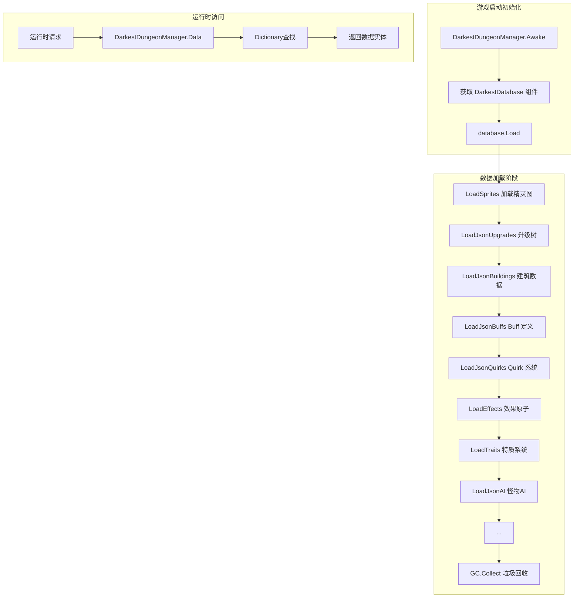
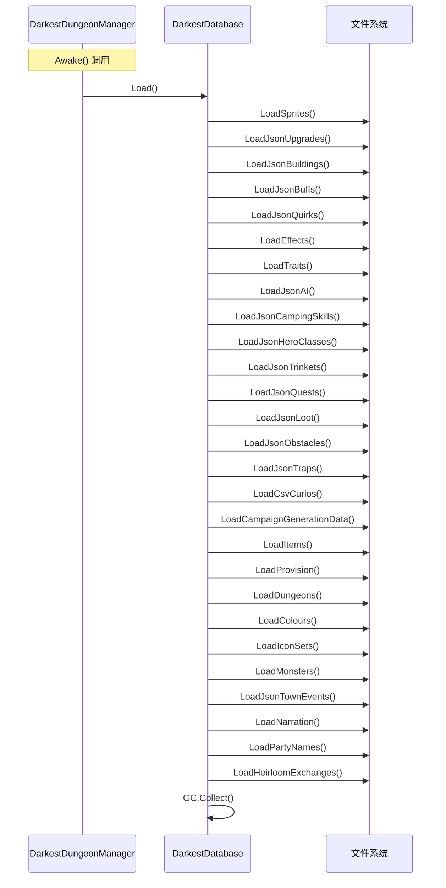
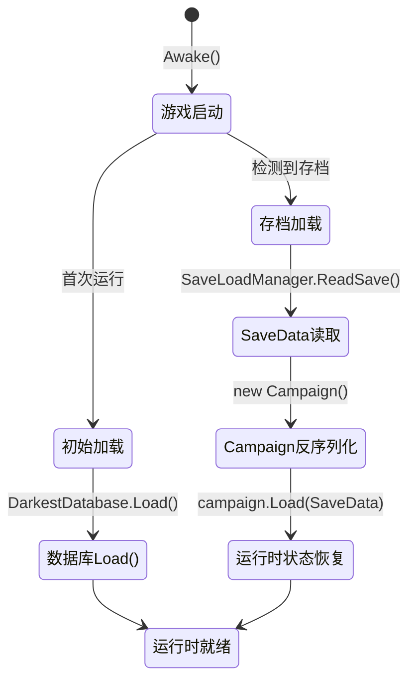
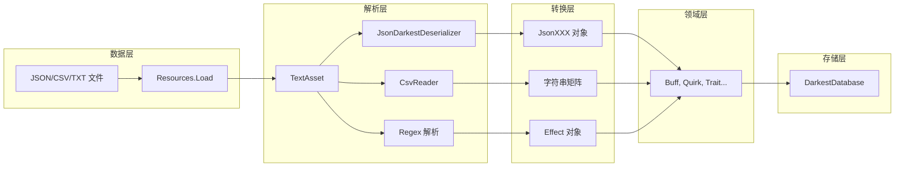
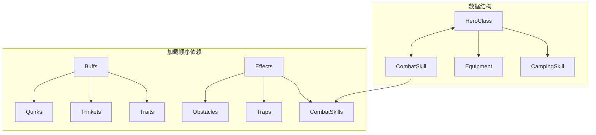

# 数据库与数据加载系统 (Database & Data Loading System)

## 文档概述

本文档详细剖析 Darkest Dungeon Unity 项目中的数据驱动架构，涵盖核心数据库类、数据解析机制、加载流程以及设计哲学。采用 WHW（What/How/Why）解析法，结合架构图和代码示例，帮助开发者深入理解系统设计。

---

## 1. 系统架构总览

### 1.1 What - 什么是数据驱动架构？

数据驱动架构是一种将游戏逻辑与数据分离的设计模式。游戏中所有可配置的内容——英雄属性、怪物数值、技能效果、掉落概率、地牢生成规则等——都存储在外部数据文件（JSON、CSV、TXT）中，游戏运行时动态加载并解析。

### 1.2 How - 系统如何运作？



### 1.3 Why - 为什么采用数据驱动？

| 优势 | 说明 |
|------|------|
| **数值平衡** | 调整伤害、血量、概率只需修改 JSON，无需重新编译 C# 代码 |
| **内容扩展** | 新增英雄职业只需按格式编写数据文件 + 提供 Spine 动画资源 |
| **多语言支持** | 文本 ID 与具体语言包解耦，本地化只需替换语言文件 |
| **存档兼容** | 存档只记录实体 ID + 动态状态，静态属性始终从数据库读取 |
| **团队协作** | 策划可独立调整数值，不影响程序代码 |

---

## 2. 核心类体系

### 2.1 DarkestDungeonManager - 游戏单例管理器

**What**: Unity MonoBehaviour 单例类，游戏启动时自动初始化，是游戏全局状态访问的入口点。

**How**:
```csharp
// DarkestDungeonManager.cs (第 4-46 行)
// 单例访问点 - 提供静态属性访问实例成员
// 注意：源码中 Instanse 为拼写错误（应为 Instance），但为与源码保持一致，文档沿用此拼写
public static DarkestDungeonManager Instanse { get; private set; }
public static DarkestDatabase Data { get { return Instanse.database; } }
public static Campaign Campaign { get { return Instanse.campaign; } }
public static RaidManager RaidManager { get { return Instanse.RaidingManager; } }

// Awake 方法确保全局唯一性
private void Awake()
{
    if (Instanse == null)
    {
        Instanse = this;
        DontDestroyOnLoad(gameObject);  // 场景切换时保留

        database = GetComponent<DarkestDatabase>();
        database.Load();  // 启动时加载所有数据
    }
    else
    {
        Destroy(gameObject);  // 防止重复创建
    }
}
```

**Why**:
- 单例模式确保全局只有一个管理器实例
- `DontDestroyOnLoad` 保证场景切换时数据持久化
- 静态属性封装实例成员，提供便捷的全局访问接口

---

### 2.2 DarkestDatabase - 核心数据仓库

**What**: 存储所有游戏静态数据的仓库类，继承 `MonoBehaviour`，在 `DarkestDungeonManager` 初始化时调用 `Load()` 方法。

**How**:
```csharp
// DarkestDatabase.cs (第 8-86 行)
// 数据仓库核心属性 - 所有数据以 Dictionary 形式存储
public Dictionary<string, Building> Buildings { get; private set; }
public Dictionary<string, UpgradeTree> UpgradeTrees { get; private set; }
public Dictionary<string, Sprite> Sprites { get; private set; }
public Dictionary<string, Sprite> DungeonSprites { get; private set; }
public Dictionary<string, MonsterBrain> Brains { get; private set; }
public Dictionary<string, MonsterData> Monsters { get; private set; }
public Dictionary<string, HeroClass> HeroClasses { get; private set; }
public Dictionary<string, Effect> Effects { get; private set; }
public Dictionary<string, Buff> Buffs { get; private set; }
public Dictionary<string, Quirk> Quirks { get; private set; }
public Dictionary<string, Curio> Curios { get; private set; }
public Dictionary<string, Obstacle> Obstacles { get; private set; }
public Dictionary<string, Trap> Traps { get; private set; }
public Dictionary<string, Dictionary<string, ItemData>> Items { get; private set; }
public Dictionary<string, DungeonEnviromentData> DungeonEnviromentData { get; private set; }

// 复合数据容器
public TownEventDatabase EventDatabase { get; private set; }
public HeroSpriteDatabase HeroSprites { get; private set; }
public QuestDatabase QuestDatabase { get; private set; }
public LootDatabase LootDatabase { get; private set; }
public ProvisionDatabase Provision { get; private set; }
public CampaignGenerationData CampaignGeneration { get; private set; }
public List<DungeonGenerationData> DungeonGenerationData { get; private set; }
```

---

## 3. 数据加载流程详解

### 3.1 Load() 方法执行序列



```csharp
// DarkestDatabase.cs (第 87-121 行)
public void Load()
{
    LoadSprites();

    LoadJsonUpgrades();
    LoadJsonBuildings();

    LoadJsonBuffs();
    LoadJsonQuirks();
    LoadEffects();
    LoadTraits();
    LoadJsonAI();
    LoadJsonCampingSkills();
    LoadJsonHeroClasses();
    LoadJsonTrinkets();
    LoadJsonQuests();
    LoadJsonLoot();
    LoadJsonObstacles();
    LoadJsonTraps();
    LoadCsvCurios();

    LoadCampaignGenerationData();
    LoadItems();
    LoadProvision();
    LoadDungeons();
    LoadColours();
    LoadIconSets();
    LoadMonsters();
    LoadJsonTownEvents();
    LoadNarration();
    LoadPartyNames();
    LoadHeirloomExchanges();

    GC.Collect();  // 加载完成后垃圾回收
}
```

**异常处理示例**:
```csharp
public void Load()
{
    try
    {
        LoadSprites();
        // ... 其他加载方法
    }
    catch (Exception ex)
    {
        Debug.LogError("数据加载失败: " + ex.Message);
        throw;
    }
}
```

**设计意图**: 分阶段加载确保依赖关系正确——例如 `Buffs` 必须在 `Quirks` 和 `Trinkets` 之前加载，因为后者引用前者。

---

### 3.2 典型加载方法剖析

#### 3.2.1 英雄职业加载 (bytes 格式)

```csharp
// DarkestDatabase.cs (第 1686-1697 行)
private void LoadJsonHeroClasses()
{
    HeroClasses = new Dictionary<string, HeroClass>();

    // 遍历 Data/Heroes/Info/ 目录下的所有 .bytes 文件
    foreach (var heroAsset in Resources.LoadAll<TextAsset>(HeroesDirectory + "Info/"))
    {
        // 使用换行符分割文本数据
        List<string> heroData = heroAsset.text.Split(
            new[] { '\r', '\n' }, StringSplitOptions.RemoveEmptyEntries).ToList();

        // 构造 HeroClass 对象，构造函数内部解析数据
        HeroClass heroClass = new HeroClass(heroData);
        HeroClasses.Add(heroClass.StringId, heroClass);
    }
}
```

**数据格式示例** (`Assets/Resources/Data/Heroes/Info/Abomination.bytes`):
```text
name: abomination
art:
.rendering: .sort_position_z_rank_override -1
.commonfx: .deathfx death_medium
.combat_skill: .id "transform" .icon "one" .anim "attack_transform" .fx "transform"
...
info:
.resistances: .stun 40% .poison 60% .bleed 30% ...
.weapon: .name "abomination_weapon_0" .atk 0% .dmg 6 11 .crit 2.5% .spd 7
.combat_skill: .id "transform" .level 0 .type "ranged" ...
.end
```

**解析逻辑** (`HeroClass.cs` 第 54-227 行):
```csharp
private void LoadData(List<string> heroData)
{
    int index = 2;
    // 第 0 行: "name: abomination" → 提取 StringId = "abomination"
    StringId = heroData[0].Split(' ')[1];

    // 第一个 while 循环：解析 art: 块（渲染/技能信息）
    // 终止条件：遇到 ".end" 标记（art 块结束）
    while(heroData[index] != ".end")
    {
        List<string> data = heroData[index++].Replace("%", "").Replace("\"", "").
            Split(new[] { ' ', '\t' }, StringSplitOptions.RemoveEmptyEntries).ToList();

        switch(data[0])
        {
            case "rendering:":
                RenderingRankOverride = int.Parse(data[2]);
                break;
            case "combat_skill:":
                SkillArtInfo skillArt = new SkillArtInfo(data, false);
                SkillArtInfo.Add(skillArt);
                break;
            // ... 其他 art 字段
        }
    }
    // index += 2 跳过 ".end" 和下一节的空行
    index += 2;

    // 第二个 while 循环：解析 info: 块（属性/技能/装备）
    // 终止条件：再次遇到 ".end" 标记（info 块结束）
    while (heroData[index] != ".end")
    {
        List<string> data = heroData[index++].Replace("%", "").Replace("\"", "").
            Split(new [] { ' ', '\t' }, StringSplitOptions.RemoveEmptyEntries).ToList();

        switch (data[0])
        {
            case "resistances:":
                // 解析抗性数据：stun poison bleed disease move debuff death_blow trap
                Resistanses.Add(AttributeType.Stun, float.Parse(data[2]) / 100);
                Resistanses.Add(AttributeType.Poison, float.Parse(data[4]) / 100);
                Resistanses.Add(AttributeType.Bleed, float.Parse(data[6]) / 100);
                Resistanses.Add(AttributeType.Disease, float.Parse(data[8]) / 100);
                Resistanses.Add(AttributeType.Move, float.Parse(data[10]) / 100);
                Resistanses.Add(AttributeType.Debuff, float.Parse(data[12]) / 100);
                Resistanses.Add(AttributeType.DeathBlow, float.Parse(data[14]) / 100);
                Resistanses.Add(AttributeType.Trap, float.Parse(data[16]) / 100);
                break;
            case "weapon:":
                // 解析武器装备数据
                Equipment weapon = new Equipment(data[2], Weapons.Count + 1, HeroEquipmentSlot.Weapon);
                weapon.EquipmentModifiers.Add(new FlatModifier(AttributeType.DamageLow, float.Parse(data[6]), false));
                weapon.EquipmentModifiers.Add(new FlatModifier(AttributeType.DamageHigh, float.Parse(data[7]), false));
                weapon.EquipmentModifiers.Add(new FlatModifier(AttributeType.CritChance, float.Parse(data[9]) / 100, false));
                weapon.EquipmentModifiers.Add(new FlatModifier(AttributeType.SpeedRating, float.Parse(data[11]), false));
                Weapons.Add(weapon);
                break;
            case "combat_skill:":
                // 解析战斗技能（包含效果数据）
                List<string> combatData = new List<string>();
                data = heroData[index - 1].Split(new [] { '\"' }, StringSplitOptions.RemoveEmptyEntries).ToList();
                bool isEffectData = false;
                foreach (var item in data)
                {
                    if (isEffectData)
                    {
                        if (item.Trim(' ').StartsWith("."))
                            isEffectData = false;
                        else
                        {
                            combatData.Add(item);
                            continue;
                        }
                    }
                    string[] combatItems = item.Replace("%", "").Split(
                        new [] { ' ', '\t' }, StringSplitOptions.RemoveEmptyEntries);
                    if (combatItems[combatItems.Length - 1] == ".effect")
                        isEffectData = true;
                    combatData.AddRange(combatItems);
                }
                CombatSkillVariants.Add(new CombatSkill(combatData, true));
                break;
            // ... 其他 info 字段
        }
    }

    // 过滤出初始可用的战斗技能（level == 0）
    CombatSkills = new List<CombatSkill>(CombatSkillVariants.FindAll(skill => skill.Level == 0));
}
```

**数据结构对应关系**:
| 数据区域 | 解析循环 | 终止条件 `.end` 作用 |
|----------|----------|---------------------|
| `art:` 块 (第 2 行至第一个 `.end`) | 第一个 `while` | 标记艺术信息解析结束 |
| `info:` 块 (`.end` 后至第二个 `.end`) | 第二个 `while` | 标记属性信息解析结束 |

#### 3.2.2 Buff 系统加载 (JSON 格式)

```csharp
// DarkestDatabase.cs (第 286-371 行)
private List<Buff> GetJsonBuffLibrary()
{
    TextAsset jsonText = Resources.Load<TextAsset>(JsonBuffDatabasePath);
    if (jsonText == null)
    {
        Debug.LogError("无法加载 Buff 数据库: " + JsonBuffDatabasePath);
        return new List<Buff>();
    }

    // 使用 JsonDarkestDeserializer 反序列化
    List<JsonBuff> jsonBuffs = JsonDarkestDeserializer.GetJsonBuffs(jsonText.text);

    List<Buff> buffs = new List<Buff>();
    for(int i = 0; i < jsonBuffs.Count; i++)
    {
        Buff buff = new Buff();
        buff.Id = jsonBuffs[i].id;
        buff.ModifierValue = jsonBuffs[i].amount;
        buff.IsFalseRule = jsonBuffs[i].is_false_rule;

        // 解析持续时间类型
        switch(jsonBuffs[i].duration_type)
        {
            case "combat_end":
                buff.DurationType = BuffDurationType.Combat;
                break;
            case "activity_end":
                buff.DurationType = BuffDurationType.Activity;
                break;
            // ...
        }

        // 解析属性类型
        switch(jsonBuffs[i].stat_type)
        {
            case "resistance":
            case "upgrade_discount":
                buff.Type = BuffType.StatAdd;
                buff.AttributeType = CharacterHelper.StringToAttributeType(...);
                break;
            // ...
        }
        buffs.Add(buff);
    }
    return buffs;
}
```

#### 3.2.3 效果原子加载 (TXT + Regex)

```csharp
// DarkestDatabase.cs (第 1854-1876 行)
private void LoadEffects()
{
    Effects = new Dictionary<string, Effect>();
    var effectsAsset = Resources.Load<TextAsset>(EffectsDataPath);
    if (effectsAsset == null)
    {
        Debug.LogError("无法加载效果数据库: " + EffectsDataPath);
        return;
    }

    // 按行分割，筛选 effect: 开头的行
    List<string> effectsStrings = effectsAsset.text.Split(
        new[] { '\r', '\n' }, StringSplitOptions.RemoveEmptyEntries).ToList();
    effectsStrings.RemoveAll(item => !item.StartsWith("effect:"));

    foreach(var effectString in effectsStrings)
    {
        // 使用正则提取所有 token（引号内容或空格分隔的词）
        List<string> effectData = Regex.Matches(effectString.Replace("\t"," "),
            @"[\""].+?[\""]|[^ ]+").Cast<Match>().Select(m => m.Value).ToList();

        // 清理引号和百分号
        for (int i = 0; i < effectData.Count; i++)
            effectData[i] = effectData[i].Replace("\"", "").Replace("%", "");

        Effect effect = new Effect(effectData);
        if (Effects.ContainsKey(effect.Name))
            Debug.LogError("Same effect: " + effect.Name);
        else
            Effects.Add(effect.Name, effect);
    }
}
```

**效果数据格式示例**:
```text
effect: .name "Stun 1" .target target .on_hit true .duration 1 .stun
effect: .name "Push 2A" .target target .push 2
effect: .name "Bleed 1" .target target .dotBleed 1 .chance 100
```

---

## 4. 数据解析机制

### 4.1 JsonDarkestDeserializer - JSON 反序列化器

**What**: 封装 Newtonsoft.Json 库，提供类型安全的 JSON 反序列化方法。

**How**:
```csharp
// DarkestJsonReader.cs (第 867-1003 行)
public static class JsonDarkestDeserializer
{
    // 泛型方法 - 反序列化任意类型
    public static JsonClass GetJsonObject<JsonClass>(string jsonString)
    {
        return JsonConvert.DeserializeObject<JsonClass>(jsonString);
    }

    // 专用方法 - 每个数据类型有对应的反序列化方法
    public static List<JsonBuff> GetJsonBuffs(string buffString)
    {
        return JsonConvert.DeserializeObject<JsonBuffData>(buffString).buffs;
    }

    public static JsonQuestDatabase GetJsonQuestDatabase(string questData)
    {
        return JsonConvert.DeserializeObject<JsonQuestDatabase>(questData);
    }

    public static List<JsonMonsterBrains> GetJsonAI(string aiString)
    {
        return JsonConvert.DeserializeObject<JsonMonsterBrainsDatabase>(aiString).monster_brains;
    }
    // ... 其他方法（GetJsonTrinkets, GetJsonQuirks, GetJsonCamping 等）
}
```

**JSON 数据结构示例** (`JsonBuffs.json`):
```json
{
   "buffs": [
      {
         "id" : "TRINKET_ACC_B1",
         "stat_type" : "combat_stat_add",
         "stat_sub_type" : "attack_rating",
         "amount" : 0.04,
         "duration_type" : "combat_end",
         "rule_type" : "always",
         "is_false_rule" : false,
         "rule_data" : { "float" : 0, "string" : "" }
      }
   ]
}
```

### 4.2 CSV 解析器 - Curio 系统

**CSV 结构假设来源**: 代码注释和 `DarkestDatabase.cs` 第 1729 行的循环逻辑确认，每 15 行为一个 Curio 的完整数据。

```csharp
// DarkestDatabase.cs (第 1725-1814 行)
private void LoadCsvCurios()
{
    Curios = new Dictionary<string, Curio>();
    // 使用 CsvReader.SplitCsvGrid 解析 CSV
    string[,] curioGrid = CsvReader.SplitCsvGrid(
        Resources.Load<TextAsset>(CsvCurioDatabasePath).text);

    // CSV 结构：每 15 行为一个 Curio 的完整数据
    // 引用来源：DarkestDatabase.cs 第 1729 行
    // for(int i = 2; i < curioGrid.GetLength(0); i += 15)
    for(int i = 2; i < curioGrid.GetLength(0); i += 15)
    {
        Curio curio = new Curio(curioGrid[i + 2, 2]);
        curio.ResultTypes = curioGrid[i, 4].ToLower();
        curio.RegionFound = curioGrid[i + 4, 2].ToLower();
        curio.IsFullCurio = curioGrid[i + 6, 2] == "Yes";

        // 解析标签
        if (curioGrid[i + 8, 2] != "")
            curio.Tags.Add(curioGrid[i + 8, 2].ToLower());

        // 解析交互结果
        for (int resultIndex = 0; resultIndex < 8; resultIndex++)
        {
            if (curioGrid[i + 2 + resultIndex, 5] != null
                && curioGrid[i + 2 + resultIndex, 5] != "")
            {
                CurioInteraction interaction = new CurioInteraction();
                interaction.ResultType = curioGrid[i + 2 + resultIndex, 4].ToLower();
                interaction.Chance = int.Parse(curioGrid[i + 2 + resultIndex, 5]);
                // ...
            }
        }
        Curios.Add(curio.StringId, curio);
    }
}
```

---

## 5. 效果原子系统 (Effect System)

### 5.1 Effect 类结构

```csharp
// Effect.cs (第 5-26 行)
public class Effect
{
    public string Name { get; private set; }
    public EffectTargetType TargetType { get; private set; }

    // 参数字典 - 支持可选的布尔/整数参数
    public Dictionary<EffectBoolParams, bool?> BooleanParams { get; private set; }
    public Dictionary<EffectIntParams, int?> IntegerParams { get; private set; }

    // 子效果列表 - 一个 Effect 可包含多个 SubEffect
    public List<SubEffect> SubEffects { get; private set; }

    public Effect(List<string> data)
    {
        // 初始化所有参数为 null（表示未设置）
        BooleanParams = new Dictionary<EffectBoolParams,bool?>();
        IntegerParams = new Dictionary<EffectIntParams, int?>();
        SubEffects = new List<SubEffect>();

        foreach(EffectBoolParams effectBool in Enum.GetValues(typeof(EffectBoolParams)))
            BooleanParams.Add(effectBool, null);
        foreach (EffectIntParams effectInteger in Enum.GetValues(typeof(EffectIntParams)))
            IntegerParams.Add(effectInteger, null);

        LoadData(data);
    }
}
```

### 5.2 效果目标类型

```csharp
// Effect.cs (第 43-79 行) - Apply 方法展示目标类型
switch(TargetType)
{
    case EffectTargetType.Performer:
        // 效果作用于施法者自身
        foreach (var subEffect in SubEffects)
            subEffect.Apply(performer, performer, this);
        break;
    case EffectTargetType.Target:
        // 效果作用于目标
        foreach (var subEffect in SubEffects)
            subEffect.Apply(performer, target, this);
        break;
    case EffectTargetType.PerformersOther:
        // 效果作用于施法者以外的所有队友
        foreach(var unit in performer.Party.Units)
            if(unit != performer)
                foreach (var subEffect in SubEffects)
                    subEffect.Apply(performer, unit, this);
        break;
    case EffectTargetType.TargetGroup:
        // 效果作用于目标全体
        foreach(var unit in target.Party.Units)
            foreach (var subEffect in SubEffects)
                subEffect.Apply(performer, unit, this);
        break;
    case EffectTargetType.Global:
        // 全局效果（如火把管理）
        if(IntegerParams[EffectIntParams.Torch].HasValue)
            RaidSceneManager.TorchMeter.DecreaseTorch(...);
        break;
}
```

---

## 6. 实时数据访问模式

### 6.1 运行时查询示例

```csharp
// 获取特定怪物配置
var monsterData = DarkestDungeonManager.Data.Monsters["skeleton_soldier"];

// 获取特定 Buff 定义
var speedBuff = DarkestDungeonManager.Data.Buffs["speed_buff_1"];

// 获取英雄职业
var crusader = DarkestDungeonManager.Data.HeroClasses["crusader"];

// 获取物品数据（嵌套字典）
var item = DarkestDungeonManager.Data.Items["weapon"]["crusader_sword"];

// 判断物品是否存在
if (DarkestDungeonManager.Data.ItemExists(itemDefinition))
{
    // 物品存在处理
}
```

### 6.2 动态地牢加载

```csharp
// DarkestDatabase.cs (第 123-156 行)
// 按需加载特定地牢的精灵资源
public void LoadDungeon(string dungeon, string quest = null)
{
    DungeonSprites.Clear();
    switch (dungeon)
    {
        case "darkestdungeon":
            switch (quest)
            {
                case "plot_darkest_dungeon_1":
                    foreach (var dungeonSprite in Resources.LoadAll<Sprite>(
                        "Dungeons/darkestdungeon/quest_1"))
                        DungeonSprites.Add(dungeonSprite.name, dungeonSprite);
                    break;
                case "plot_darkest_dungeon_2":
                    foreach (var dungeonSprite in Resources.LoadAll<Sprite>(
                        "Dungeons/darkestdungeon/quest_2"))
                        DungeonSprites.Add(dungeonSprite.name, dungeonSprite);
                    break;
                case "plot_darkest_dungeon_3":
                    foreach (var dungeonSprite in Resources.LoadAll<Sprite>(
                        "Dungeons/darkestdungeon/quest_3"))
                        DungeonSprites.Add(dungeonSprite.name, dungeonSprite);
                    break;
                case "plot_darkest_dungeon_4":
                    foreach (var dungeonSprite in Resources.LoadAll<Sprite>(
                        "Dungeons/darkestdungeon/quest_4"))
                        DungeonSprites.Add(dungeonSprite.name, dungeonSprite);
                    break;
                default:
                    goto case "plot_darkest_dungeon_1";
            }
            break;
        // crypts, warrens, cove, weald 等其他地牢类型
        // 均走 default 分支：直接加载对应 Dungeons/{dungeon} 路径下的所有 Sprite
        default:
            var sprites = Resources.LoadAll<Sprite>("Dungeons/" + dungeon);
            foreach (var dungeonSprite in sprites)
                DungeonSprites.Add(dungeonSprite.name, dungeonSprite);
            break;
    }
}
```

---

## 7. 存档加载与初始加载的区分

### 7.1 状态流转总览



### 7.2 初始加载流程

**场景**: 首次运行游戏，无存档数据

```csharp
// DarkestDungeonManager.cs (第 64-87 行)
private void Awake()
{
    if (Instanse == null)
    {
        // ...
        database = GetComponent<DarkestDatabase>();
        database.Load();  // 加载所有静态数据
    }
}
```

### 7.3 存档加载流程

**场景**: 从 EstateManagement 或 Dungeon 场景进入

```csharp
// DarkestDungeonManager.cs (第 89-103 行)
private void Awake()
{
    if (Instanse == null)
    {
        // ...
        database = GetComponent<DarkestDatabase>();
        database.Load();
    }

    // 场景切换后加载存档
    if (SceneManager.GetActiveScene().name == "Dungeon")
    {
        LoadSave();
        // ...
    }
    else if (SceneManager.GetActiveScene().name == "EstateManagement")
    {
        LoadSave();
    }
}

// SaveLoadManager.cs - 存档读写
public void LoadSave()
{
    if (SaveData == null)
    {
        // 创建测试存档
        SaveLoadManager.WriteStartingSave(new SaveCampaignData(1, "Darkest"));
        SaveLoadManager.WriteTestingSave(new SaveCampaignData(2, "Middle"));
        SaveData = SaveLoadManager.ReadSave(2);
    }
    campaign = new Campaign();
    campaign.Load(SaveData);  // 反序列化并恢复运行时状态
}
```

**存档数据结构** (`SaveCampaignData.cs`):
```csharp
public class SaveCampaignData
{
    // 庄园状态
    public bool IsFirstStart;
    public string HamletTitle;
    public int CurrentWeek;
    public int QuestsCompleted;
    public List<SaveHeroData> RosterHeroes;  // 英雄数据
    public Dictionary<string, DungeonProgress> DungeonProgress;

    // 远征状态
    public bool InRaid { get; set; }
    public Quest Quest { get; set; }
    public Dungeon Dungeon { get; set; }
    public RaidPartySaveData RaidParty;
    // ...
}
```

**Campaign.Load 反序列化** (`Campaign.cs` 第 38-99 行):
```csharp
public void Load(SaveCampaignData saveData)
{
    // 恢复事件状态
    EventModifiers = saveData.EventModifers;
    foreach (var townEvent in DarkestDungeonManager.Data.EventDatabase.Events)
        townEvent.SetDefaultState();

    // 恢复周目进度
    CurrentWeek = saveData.CurrentWeek;
    QuestsComleted = saveData.QuestsCompleted;

    // 恢复庄园经济
    Estate = new Estate(saveData);
    RealmInventory = new RealmInventory(saveData);

    // 恢复英雄阵容
    Heroes = new List<Hero>();
    saveData.RosterHeroes.ForEach(hero => Heroes.Add(new Hero(Estate, hero)));

    // 恢复地牢进度
    Dungeons = saveData.DungeonProgress;
    Quests = saveData.GeneratedQuests;

    // 恢复事件状态
    if (saveData.CurrentEvent != "")
    {
        TriggeredEvent = DarkestDungeonManager.Data.EventDatabase.Events
            .Find(townEvent => townEvent.Id == saveData.CurrentEvent);
    }
    // ...
}
```

**关键区分点**:
| 阶段 | 数据来源 | 说明 |
|------|----------|------|
| 初始加载 | `Resources.Load()` | 从 JSON/CSV/TXT 文件加载静态数据 |
| 存档加载 | `SaveCampaignData` | 从二进制/JSON 存档文件恢复动态状态 |

---

## 8. 设计哲学分析

### 8.1 高内聚设计

每个数据加载方法职责单一：
- `LoadJsonBuffs()` - 只负责加载 Buff
- `LoadJsonQuirks()` - 只负责加载 Quirk
- `LoadEffects()` - 只负责加载效果原子

```csharp
// 方法级别的内聚 - 每个方法只做一件事
private List<Buff> GetJsonBuffLibrary() { /* 仅解析 Buff */ }
private List<Quirk> GetJsonQuirkLibrary() { /* 仅解析 Quirks */ }
private List<Trap> GetJsonTrapLibrary() { /* 仅解析 Trap */ }
```

### 8.2 解耦策略



**解耦点**:
1. **数据格式解耦**: TXT(bytes)、JSON、CSV 三种格式并行，解析逻辑分散在各自方法中
2. **数据类型解耦**: 每种数据类型有独立的 Dictionary 存储
3. **访问接口解耦**: 通过 `DarkestDungeonManager.Data` 静态属性访问，隐藏实现细节

### 8.3 设计模式应用

| 模式 | 应用位置 | 说明 |
|------|----------|------|
| **单例模式** | DarkestDungeonManager | 确保全局唯一实例 |
| **工厂模式** | Effect 构造函数 | 根据 token 类型创建不同 SubEffect |
| **策略模式** | AI 欲望系统 | SkillDesireSet, TargetDesireSet 支持多种选择策略 |
| **门面模式** | DarkestDungeonManager.Data | 统一入口封装所有数据访问 |
| **空对象模式** | BooleanParams/IntegerParams | 使用 null 表示"未设置"而非默认值 |

### 8.4 依赖关系图



**说明**:
- `HeroClass` 与 `CombatSkill` 之间为双向关系
- `HeroClass` 持有 `List<CombatSkill>` (定义时)
- `CombatSkill` 通过 `hero.HeroClass.StringId` 获取英雄标识（用于本地化等）

---

## 9. 数据目录结构

```
Assets/Resources/Data/
├── Heroes/
│   └── Info/                    # 英雄定义 (.bytes)
│       ├── Abomination.bytes
│       ├── Crusader.bytes
│       └── Vestal.bytes
├── Monsters/                   # 怪物定义 (.txt)
│   ├── skeleton_soldier_A.txt
│   └── collector_A.txt
├── Inventory/
│   └── Items.bytes             # 物品数据
├── Mechanics/
│   ├── Effects.txt             # 效果原子定义
│   ├── MapGenerator            # 地牢生成规则
│   └── TownEvents              # 城镇事件
├── Dungeons/                    # 地牢环境配置
│   ├── Crypts.bytes
│   ├── Warrens.bytes
│   └── Cove.bytes
├── Curios/
│   ├── Curios.csv              # 交互物品（每 15 行为一个 Curio）
│   ├── Traps.json              # 陷阱配置
│   └── Obstacles.json          # 障碍物配置
├── Buildings/                   # 建筑升级配置 (.building.json)
│   ├── abbey.building.json
│   └── stage_coach.building.json
├── JsonAI.json                 # 怪物 AI 行为
├── JsonBuffs.json              # Buff 定义
├── JsonQuirks.json             # Quirk 定义
├── JsonTrinkets.json           # Trinket 数据
├── JsonQuests.json             # 任务系统
├── JsonCamping.json            # 扎营技能
├── JsonLoot.json               # 掉落表
├── JsonTraits.json             # 特质系统
└── Localization/               # 多语言文件
    ├── Activity.xml
    └── Actors.xml
```

---

## 10. 扩展指南

### 10.1 新增英雄职业步骤

1. 在 `Data/Heroes/Info/` 创建 `.bytes` 文件
2. 定义格式参考 `Abomination.bytes`
3. 在 `Spine/Animations/` 添加动画资源
4. 游戏中自动加载，无需修改代码

### 10.2 新增 Buff 类型

1. 在 `JsonBuffs.json` 添加 JSON 条目
2. 如需新属性扩展，在 `EffectBoolParams`/`EffectIntParams` 枚举中添加

### 10.3 新增效果原子

1. 在 `Data/Mechanics/Effects.txt` 添加行：
   ```text
   effect: .name "My Effect" .target target .heal 10
   ```

---

## 11. 关键代码位置索引

| 功能 | 文件路径 | 关键方法/类 |
|------|----------|-------------|
| 数据库入口 | `Scripts/Managers/DarkestDungeonManager.cs` | Awake(), Data 属性 |
| 数据仓库 | `Scripts/Database/DarkestDatabase.cs` | Load(), 各 LoadXxx 方法 |
| JSON 解析 | `Scripts/Database/DarkestJsonReader.cs` | JsonDarkestDeserializer |
| 效果系统 | `Scripts/Mechanics/Skills/Effect.cs` | Effect 类, LoadData() |
| 英雄定义 | `Scripts/Character/HeroClass.cs` | HeroClass(List<string>) |
| 存档管理 | `Scripts/Setup/SaveSystem/SaveLoadManager.cs` | ReadSave(), WriteSave() |
| 存档数据 | `Scripts/Setup/SaveSystem/SaveCampaignData.cs` | SaveCampaignData 类 |
| 战役管理 | `Scripts/Campaign/Campaign.cs` | Load(SaveCampaignData) |

---

[返回主页](Index.md)
