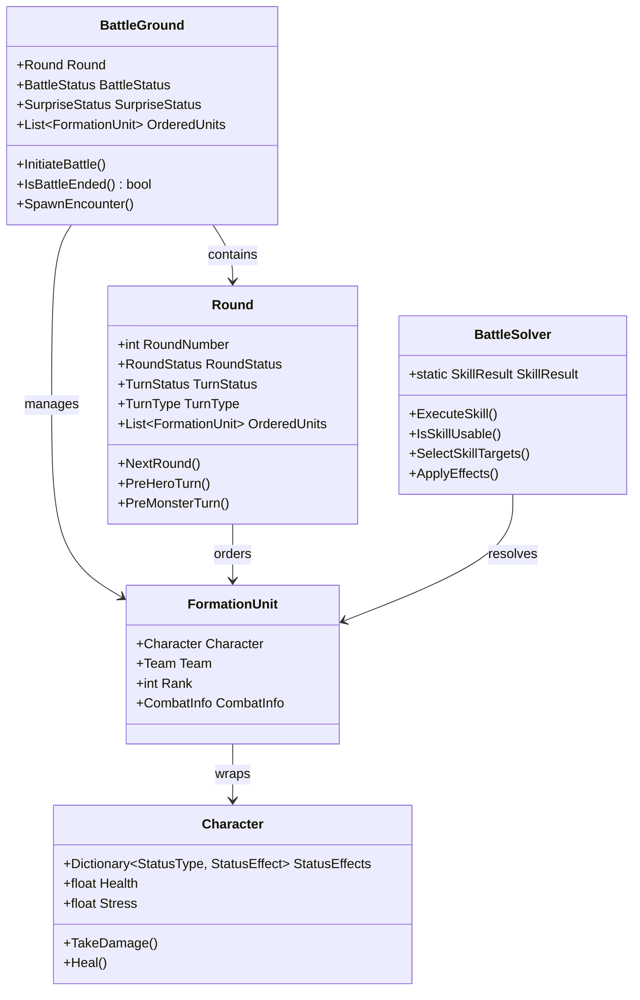
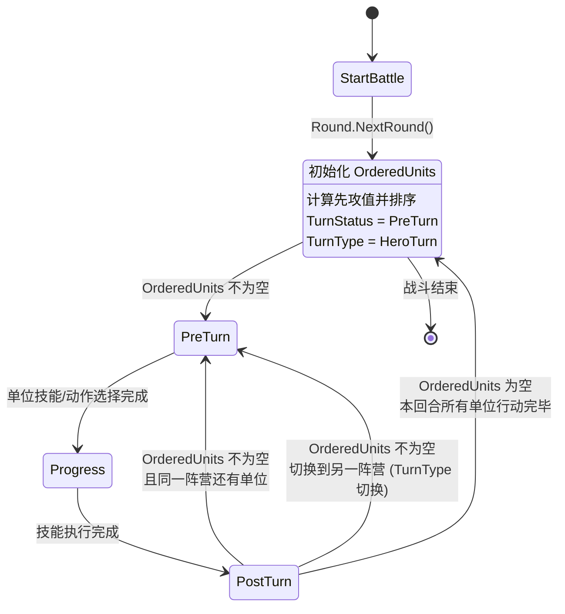
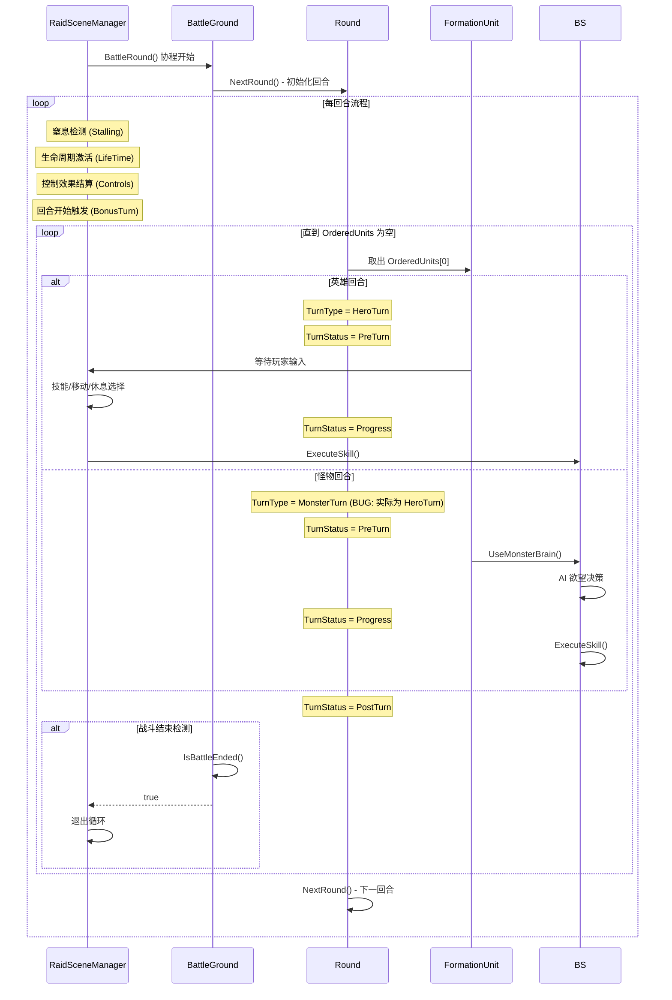
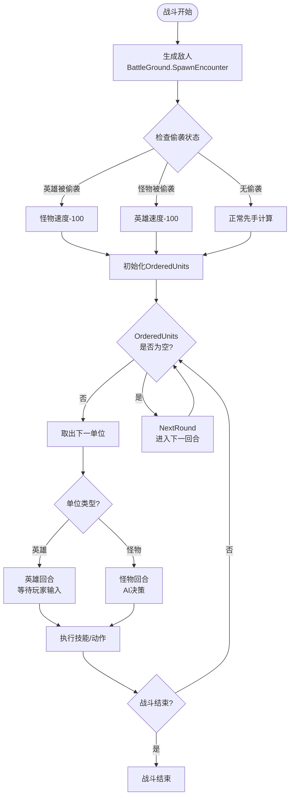
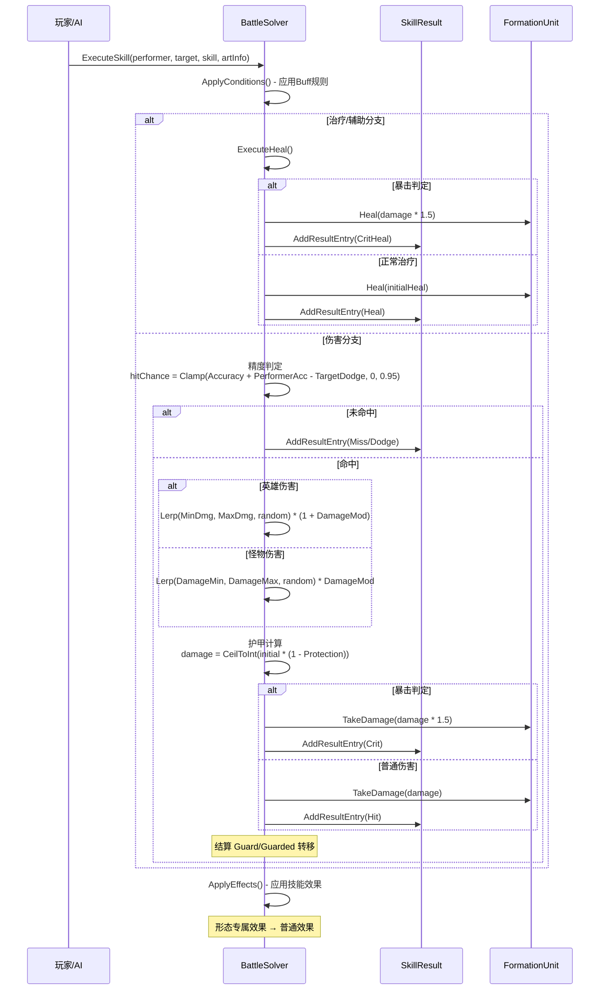
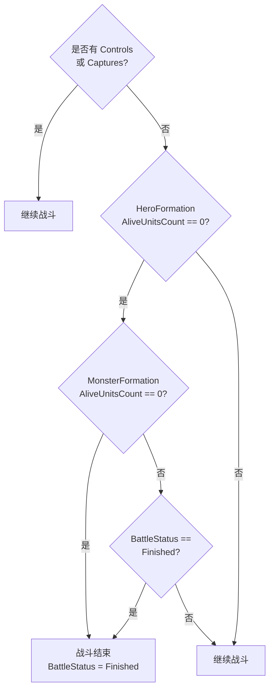

# Darkest Dungeon Unity 战斗机制深度技术文档

> **What/How/Why 解析法说明**
> - **What**: 该系统/组件是什么，解决什么问题
> - **How**: 具体实现机制与数据流
> - **Why**: 设计决策的背景与权衡

本系统采用**回合制 (Turn-Based)** 战斗模式，核心逻辑围绕 `BattleGround` 战场管理、`Round` 回合调度和 `BattleSolver` 技能结算三大支柱展开。通过数据驱动的技能定义和基于欲望（Desire）的 AI 决策，实现了高度灵活且可配置的回合制战斗体验。

---

## 目录

1. [核心数据结构](#1-核心数据结构)
2. [战斗流程总览](#2-战斗流程总览)
3. [行动顺序系统](#3-行动顺序系统)
4. [技能选择与目标确定](#4-技能选择与目标确定)
5. [伤害结算流程](#5-伤害结算流程)
6. [状态效果系统](#6-状态效果系统)
7. [战斗结束判定](#7-战斗结束判定)
8. [AI 决策机制](#8-ai-决策机制)
9. [特殊结算机制](#9-特殊结算机制)
10. [关键文件索引](#10-关键文件索引)

---

## 1. 核心数据结构

### 1.0 战斗系统整体架构



---

### 1.1 战场状态枚举

```csharp
// 战斗状态
public enum BattleStatus { Peace, Fighting, Finished }

// 回合状态
public enum RoundStatus { Start, Progress, Finish }

// 回合内状态
public enum TurnStatus { PreTurn, Progress, PostTurn }

// 行动者类型
public enum TurnType { HeroTurn, MonsterTurn }

// 偷袭状态
public enum SurpriseStatus { Nothing, MonstersSurprised, HeroesSurprised }

// 队伍
public enum Team { Heroes, Monsters }
```

---

### 1.2 `BattleGround` - 战场管理器

**What:** 战斗的核心容器，管理所有战斗状态、队伍信息和回合调度。

**How:**

```csharp
public class BattleGround : MonoBehaviour
{
    // 序列化字段
    [SerializeField] private BattleFormation heroFormation;
    [SerializeField] private BattleFormation monsterFormation;
    [SerializeField] private SharedHealthInfo sharedHealthRecord;
    [SerializeField] private RectTransform heroPosition;
    [SerializeField] private RectTransform monsterPosition;
    [SerializeField] private RectTransform cameraFocus;
    [SerializeField] private Backdrop backdrop;

    // Public 属性
    public BattleFormation HeroFormation { get { return heroFormation; } }
    public BattleFormation MonsterFormation { get { return monsterFormation; } }
    public FormationParty HeroParty { get { return heroFormation.Party; } }
    public FormationParty MonsterParty { get { return monsterFormation.Party; } }
    public SharedHealthInfo SharedHealth { get { return sharedHealthRecord; } }
    public RectTransform Rect { get; set; }

    public string LastSkillUsed { get; set; }
    public int StallingRoundNumber { get; set; }
    public BattleStatus BattleStatus { get; set; }

    public SurpriseStatus SurpriseStatus { get; private set; }
    public RoundStatus RoundStatus { get { return Round.RoundStatus; } }
    public TurnStatus TurnStatus { get { return Round.TurnStatus; } }
    public Round Round { get; private set; }

    public List<int> CombatIds { get; private set; }
    public List<CompanionRecord> Companions { get; private set; }
    public List<CaptureRecord> Captures { get; private set; }
    public List<ControlRecord> Controls { get; private set; }
    public List<LootDefinition> BattleLoot { get; private set; }
    public List<string> LastDamaged { get; private set; }

    // 计算属性
    public int HeroNumber { get { return HeroParty.Units.Count; } }
    public int MarkedHeroes { get; }
    public int VirtuedHeroes { get; }
    public int NonVirtuedHeroes { get; }
    public int NonDeathsDoorHeroes { get; }
    public int ControlCount { get { return Controls.Count; } }
    public int MonsterNumber { get; }
    public int GuardedMonsters { get; }
    public int MonsterSize { get; }
}
```

**关键职责：**
- 战斗初始化 (`InitiateBattle`)
- 敌人生成 (`SpawnEncounter`)
- 战斗结束判定 (`IsBattleEnded`)
- 单位管理（捕获、控制、召唤）

---

### 1.3 `Round` - 回合调度器

**What:** 管理回合生命周期、行动顺序队列和状态转换。

**How:**

```csharp
public class Round
{
    public int RoundNumber { get; set; }

    public RoundStatus RoundStatus { get; set; }
    public TurnType TurnType { get; set; }
    public TurnStatus TurnStatus { get; set; }

    public HeroTurnAction HeroAction { get; set; }
    public FormationUnit SelectedUnit { get; set; }
    public FormationUnit SelectedTarget { get; set; }

    public List<FormationUnit> OrderedUnits { get; private set; }
}
```

**回合生命周期（状态机）：**

`TurnStatus` 枚举定义：`{ PreTurn, Progress, PostTurn }`



**状态转换触发条件详解：**

| 当前状态 | 转换条件 | 下一状态 | 说明 |
|----------|----------|----------|------|
| `PreTurn` | 单位已完成技能/动作选择 | `Progress` | 进入技能执行阶段 |
| `Progress` | 技能效果结算完毕 | `PostTurn` | 结算后处理 |
| `PostTurn` | `OrderedUnits` 还有同阵营单位 | `PreTurn` | 继续处理下一单位 |
| `PostTurn` | `OrderedUnits` 为空 | `RoundStart` | 本回合结束，调用 `NextRound()` |
| `PostTurn` | 同阵营单位已全部行动完毕，但 `OrderedUnits` 还有他阵营单位 | `PreTurn` | `TurnType` 切换到另一阵营 |

**TurnType 设置顺序（重要）：**

英雄回合 (`PreHeroTurn`)：
```csharp
TurnType = TurnType.HeroTurn;   // 先设置 TurnType
TurnStatus = TurnStatus.PreTurn; // 后设置 TurnStatus
```

怪物回合 (`PreMonsterTurn`)：
```csharp
TurnType = TurnType.HeroTurn;   // 先设置 TurnType (注意：此处为 BUG，实际应为 MonsterTurn)
TurnStatus = TurnStatus.PreTurn; // 后设置 TurnStatus
```

**BUG 标注：** `PreMonsterTurn` 方法中 `TurnType = TurnType.HeroTurn` 是代码错误，应为 `TurnType.MonsterTurn`。此 BUG 导致怪物回合时 `TurnType` 仍为 `HeroTurn`，可能影响依赖 `TurnType` 判断的逻辑。

---

## 2. 战斗流程总览

### 2.1 主循环入口：`BattleRound` 协程

战斗的核心循环位于 `RaidSceneManager.BattleRound` 协程：



### 2.2 回合初始化流程 (`NextRound`)

```csharp
public int NextRound(BattleGround battleground)
{
    RoundStatus = RoundStatus.Start;
    OrderedUnits.Clear();

    // Round 1 前置Buff处理
    if (RoundNumber == 0 || RoundNumber == 1)
    {
        battleground.HeroFormation.UpdateBuffRule(BuffRule.FirstRound);
        battleground.MonsterFormation.UpdateBuffRule(BuffRule.FirstRound);
    }

    // 将所有存活单位加入行动队列
    foreach (var unit in battleground.HeroParty.Units)
    {
        unit.CombatInfo.UpdateNextRound();
        OrderedUnits.Add(unit);
    }

    foreach (var unit in battleground.MonsterParty.Units)
    {
        unit.CombatInfo.UpdateNextRound();
        // 怪物根据 NumberOfTurns 可能有多个行动
        if (unit.Character.IsMonster)
            for (int i = 0; i < unit.Character.Initiative.NumberOfTurns; i++)
                OrderedUnits.Add(unit);
        else
            OrderedUnits.Add(unit);
    }

    // 根据偷袭状态调整排序
    if (RoundNumber == 0)
    {
        if (SurpriseStatus == HeroesSurprised)
            // 英雄速度 -100，确保怪物先手
        else if (SurpriseStatus == MonstersSurprised)
            // 怪物速度 -100（如果可被惊吓）
        else
            // 正常排序
    }
    else
        // 正常速度排序

    return ++RoundNumber;
}
```

### 2.3 战斗流程状态图



---

## 3. 行动顺序系统

### 3.1 先攻值计算

**公式：**
```
最终先攻 = Speed + Random(0, 3) + RandomDouble()
```

**关键代码：**
```csharp
// Round.cs - NextRound() 中的排序逻辑
OrderedUnits = new List<FormationUnit>(OrderedUnits.OrderByDescending(unit =>
    unit.Character.Speed + RandomSolver.Next(0, 3) + RandomSolver.NextDouble()));
```

### 3.2 偷袭惩罚

| 偷袭情况 | 受影响方 | 惩罚值 |
|----------|----------|--------|
| 英雄被偷袭 | 英雄 | Speed - 100 |
| 怪物被偷袭（可被惊吓） | 怪物 | Speed - 100 |

**关键代码：**
```csharp
if (RaidSceneManager.BattleGround.SurpriseStatus == SurpriseStatus.HeroesSurprised)
{
    OrderedUnits = new List<FormationUnit>(OrderedUnits.OrderByDescending(unit =>
        unit.Character.IsMonster ?
        unit.Character.Speed + RandomSolver.Next(0, 3) + RandomSolver.NextDouble() :
        unit.Character.Speed + RandomSolver.Next(0, 3) + RandomSolver.NextDouble() - 100));  // 英雄-100
}
```

### 3.3 怪物多回合机制

某些怪物拥有 `NumberOfTurns > 1`，会在同一回合内获得多次行动机会：

```csharp
// Round.cs - NextRound()
if (unit.Character.IsMonster)
    for (int i = 0; i < unit.Character.Initiative.NumberOfTurns; i++)
        OrderedUnits.Add(unit);  // 同一单位多次加入队列
```

### 3.4 临时插入机制

战斗过程中可以插入新的行动（如召唤物）：

```csharp
public void InsertInitiativeRoll(FormationUnit unit)
{
    // 按速度插入到合适位置
    for (int i = 0; i < OrderedUnits.Count; i++)
    {
        if (OrderedUnits[i].Character.Speed < unit.Character.Speed - 2)
        {
            OrderedUnits.Insert(i, unit);
            return;
        }
    }
    OrderedUnits.Add(unit);
}
```

---

## 4. 技能选择与目标确定

### 4.1 技能可用性检测

```csharp
public static bool IsSkillUsable(FormationUnit performer, CombatSkill skill)
{
    FormationParty friends;
    FormationParty enemies;
    if (performer.Team == Team.Heroes)
    {
        friends = RaidSceneManager.BattleGround.HeroParty;
        enemies = RaidSceneManager.BattleGround.MonsterParty;
    }
    else
    {
        friends = RaidSceneManager.BattleGround.MonsterParty;
        enemies = RaidSceneManager.BattleGround.HeroParty;
    }

    // 检测施法者站位是否在 LaunchRanks 内
    return skill.LaunchRanks.IsLaunchableFrom(performer.Rank, performer.Size) &&
        skill.HasAvailableTargets(performer, friends, enemies);
}
```

**注意：** `IsSkillUsable` 本身不检查 `BlockedHealUnitIds`/`BlockedBuffUnitIds`。这些阻止检查位于 `IsPerformerSkillTargetable` 方法中，用于目标选择时的过滤。

### 4.2 目标选择逻辑

```csharp
public static SkillTargetInfo SelectSkillTargets(FormationUnit performer,
    FormationUnit primaryTarget, CombatSkill skill)
{
    // 自定义技能 - 仅目标自己
    if (skill.TargetRanks.IsSelfTarget)
        return new SkillTargetInfo(performer, SkillTargetType.Self);

    // 友方技能
    if (skill.TargetRanks.IsSelfFormation)
    {
        if (skill.TargetRanks.IsMultitarget)
        {
            var targets = performer.Team == Team.Heroes ?
                new List<FormationUnit>(RaidSceneManager.BattleGround.HeroParty.Units) :
                new List<FormationUnit>(RaidSceneManager.BattleGround.MonsterParty.Units);

            if (!skill.IsSelfValid)
                targets.Remove(performer);

            // 友方多目标过滤 - 使用 IsTargetableUnit 检查
            for (int i = targets.Count - 1; i >= 0; i--)
                if (!skill.TargetRanks.IsTargetableUnit(targets[i]))
                    targets.Remove(targets[i]);

            return new SkillTargetInfo(targets, SkillTargetType.Party);
        }
        else
            return new SkillTargetInfo(primaryTarget, SkillTargetType.Party);
    }
    else  // 敌方技能
    {
        if (skill.TargetRanks.IsMultitarget)
        {
            var targets = performer.Team == Team.Heroes ?
                new List<FormationUnit>(RaidSceneManager.BattleGround.MonsterParty.Units) :
                new List<FormationUnit>(RaidSceneManager.BattleGround.HeroParty.Units);

            // 敌方多目标过滤 - 使用 IsTargetableUnit 检查
            for (int i = targets.Count - 1; i >= 0; i--)
                if (!skill.TargetRanks.IsTargetableUnit(targets[i]))
                    targets.Remove(targets[i]);

            return new SkillTargetInfo(targets, SkillTargetType.Enemy);
        }
        else
            return new SkillTargetInfo(primaryTarget, SkillTargetType.Enemy);
    }
}
```

### 4.3 目标类型枚举

```csharp
public enum SkillTargetType
{
    Self,      // 仅自己
    Party,     // 友方（单体或全体）
    Enemy      // 敌方（单体或全体）
}
```

---

## 5. 伤害结算流程

### 5.1 完整结算时序



**伤害分支闭合说明：**

伤害分支的闭合点位于 `ExecuteSkill` 方法的最后，所有伤害计算完成后的统一出口：

1. 命中判定分支闭合（Miss/Dodge 或 命中）
2. 命中后伤害计算分支闭合（英雄/怪物伤害）
3. 暴击判定分支闭合（暴击/普通伤害）
4. Guard 转移在主分支内作为后处理结算

### 5.2 命中判定

**公式：**
```
命中率 = Clamp(技能精度 + 施法者精度 - 目标闪避, 0, 0.95)
```

**代码实现：**
```csharp
float accuracy = skill.Accuracy + performer.Accuracy;
float hitChance = Mathf.Clamp(accuracy - target.Dodge, 0, 0.95f);
float roll = (float)RandomSolver.NextDouble();

// 检测不可被命中修饰
if (target.BattleModifiers != null && target.BattleModifiers.CanBeHit == false)
    roll = float.MaxValue;

if (roll > hitChance)
{
    if (!(skill.CanMiss == false ||
          (target.BattleModifiers != null && target.BattleModifiers.CanBeMissed == false)))
    {
        if (roll > Mathf.Min(accuracy, 0.95f))
            SkillResult.AddResultEntry(new SkillResultEntry(targetUnit, SkillResultType.Miss));
        else
            SkillResult.AddResultEntry(new SkillResultEntry(targetUnit, SkillResultType.Dodge));
        return;
    }
}
```

### 5.3 伤害计算

**英雄伤害公式：**
```
初始伤害 = Lerp(MinDamage, MaxDamage, random) × (1 + SkillDamageMod)
```

**怪物伤害公式：**
```
初始伤害 = Lerp(SkillDamageMin, SkillDamageMax, random) × MonsterDamageMod
```

**护甲减免：**
```
最终伤害 = CeilToInt(初始伤害 × (1 - Protection))
```

**代码实现：**
```csharp
float initialDamage = performer is Hero ?
    Mathf.Lerp(performer.MinDamage, performer.MaxDamage,
        (float)RandomSolver.NextDouble()) * (1 + skill.DamageMod) :
    Mathf.Lerp(skill.DamageMin, skill.DamageMax,
        (float)RandomSolver.NextDouble()) * performer.DamageMod;

int damage = Mathf.CeilToInt(initialDamage * (1 - target.Protection));
if (damage < 0) damage = 0;

// 检测直接伤害豁免
if (target.BattleModifiers != null && target.BattleModifiers.CanBeDamagedDirectly == false)
    damage = 0;
```

### 5.4 暴击判定

**暴击伤害倍率：** 1.5 倍

**暴击率计算：**
```
暴击率 = PerformerCritChance + SkillCritMod
```

```csharp
if (skill.IsCritValid)
{
    float critChance = performer.GetSingleAttribute(AttributeType.CritChance).ModifiedValue + skill.CritMod;
    if (RandomSolver.CheckSuccess(critChance))
    {
        int critDamage = target.TakeDamage(damage * 1.5f);
        SkillResult.AddResultEntry(new SkillResultEntry(targetUnit, critDamage, SkillResultType.Crit));

        // 英雄暴击触发全队减压
        if (targetUnit.Character.IsMonster == false)
            DarkestDungeonManager.Data.Effects["Stress 2"].ApplyIndependent(targetUnit);
        return;
    }
}
```

### 5.5 伤害公式汇总

| 计算步骤 | 公式 | 说明 |
|----------|------|------|
| **命中判定** | `hitChance = Clamp(SkillAccuracy + PerformerAccuracy - TargetDodge, 0, 0.95)` | 上限 95% |
| **英雄伤害** | `Lerp(MinDmg, MaxDmg, random) * (1 + DamageMod)` | 角色属性区间 |
| **怪物伤害** | `Lerp(DamageMin, DamageMax, random) * DamageMod` | 技能固定区间 |
| **护甲减免** | `damage = CeilToInt(initialDamage * (1 - Protection))` | Protection 为 0-1 小数 |
| **暴击伤害** | `damage * 1.5` | 固定 1.5 倍 |

---

## 6. 状态效果系统

### 6.1 StatusEffect 抽象基类

**实际源码结构：**

```csharp
public abstract class StatusEffect
{
    public abstract StatusType Type { get; }
    public abstract bool IsApplied { get; }

    public abstract void UpdateNextTurn();
    public abstract void ResetStatus();
    public abstract void WriteStatusData(BinaryWriter bw);
    public abstract void ReadStatusData(BinaryReader br);
}
```

**重要说明：** `StatusEffect` 基类只有 6 个抽象成员，不存在 `Apply()`、`Duration`、`StackCount`、`Value` 等属性或方法。这些是子类各自实现的特有逻辑。

### 6.2 状态效果类型

战斗中的状态效果通过 `Character.StatusEffects` 字典管理：

```csharp
// Character.cs - InitializeBasicStatuses()
protected Dictionary<StatusType, StatusEffect> StatusEffects;

public static void InitializeBasicStatuses(Dictionary<StatusType, StatusEffect> targetDictionary)
{
    targetDictionary.Add(StatusType.Stun, new StunStatusEffect());
    targetDictionary.Add(StatusType.Marked, new MarkStatusEffect());
    targetDictionary.Add(StatusType.Riposte, new RiposteStatusEffect());
    targetDictionary.Add(StatusType.Bleeding, new BleedingStatusEffect());
    targetDictionary.Add(StatusType.Poison, new PoisonStatusEffect());
    targetDictionary.Add(StatusType.Guard, new GuardStatusEffect());
    targetDictionary.Add(StatusType.Guarded, new GuardedStatusEffect());
    targetDictionary.Add(StatusType.DeathsDoor, new DeathsDoorStatusEffect());
    targetDictionary.Add(StatusType.DeathRecovery, new DeathRecoveryStatusEffect());
}
```

### 6.3 状态效果分类

| 状态类型 | 说明 | 典型效果 |
|----------|------|----------|
| **Stun** | 眩晕 | 跳过下一次行动 |
| **Marked** | 标记 | AI 优先攻击被标记目标 |
| **Riposte** | 反击 | 受到攻击时自动反击 |
| **Bleeding** | 流血 | 每回合受到持续伤害（DOT） |
| **Poison** | 中毒 | 每回合受到持续伤害（DOT） |
| **Guard** | 保护 | 为指定目标承受攻击 |
| **Guarded** | 被保护 | 被指定目标保护 |
| **DeathsDoor** | 濒死 | HP为0时进入濒死状态 |
| **DeathRecovery** | 死亡恢复 | 濒死恢复中 |

### 6.4 状态效果访问

```csharp
// 通过索引器访问 - 语法：Character[StatusType.xxx]
var stunEffect = character[StatusType.Stun];

// 检测是否已应用
if (character[StatusType.Stun].IsApplied)
{
    // 单位被眩晕
}
```

**索引器定义（Character.cs）：**
```csharp
public StatusEffect this[StatusType type]
{
    get
    {
        if (type != StatusType.None)
            return StatusEffects[type];
        else
            return null;
    }
}
```

### 6.5 DOT 类状态（DamageOverTimeStatusEffect）

DOT 状态继承自 `DamageOverTimeStatusEffect`，其结构如下：

```csharp
public abstract class DamageOverTimeStatusEffect : StatusEffect
{
    public override bool IsApplied { get { return doTs.Count > 0; } }

    private readonly List<DamageOverTimeInstanse> doTs = new List<DamageOverTimeInstanse>();

    // 当前每回合伤害（所有层叠加）
    public int CurrentTickDamage { get { return doTs.Count > 0 ? doTs.Sum(dot => dot.TickDamage) : 0; } }

    // 组合总伤害（当前剩余回合数 × 每回合伤害）
    public int CombinedDamage { get { return doTs.Count > 0 ? doTs.Sum(dot => dot.TicksLeft * dot.TickDamage) : 0; } }

    // 剩余最长时间（最多还有几回合）
    public int ExpirationTime { get { return doTs.Count > 0 ? doTs.Max(dot => dot.TicksLeft) : 0; } }

    public override void UpdateNextTurn()
    {
        for (int i = doTs.Count - 1; i >= 0; i--)
            if (doTs[i].CheckExpiration())
                doTs.RemoveAt(i);
    }

    public void AddInstanse(DamageOverTimeInstanse newInstance)
    {
        doTs.Add(newInstance);
    }

    public void RemoveDoT()
    {
        doTs.Clear();
    }
}
```

**DOT 结算位置：** DOT 伤害结算不在 `ProcessDotEffects` 方法中（该方法不存在），而是在 `RaidSceneManager.cs` 中直接通过 `CurrentTickDamage` 属性访问并结算。

### 6.6 Guard / Guarded 保护链路协同机制

#### 6.6.1 GuardStatusEffect 实际结构

```csharp
public class GuardStatusEffect : StatusEffect
{
    public override StatusType Type { get { return StatusType.Guard; } }
    public override bool IsApplied { get { return Targets.Count > 0; } }

    // 使用列表存储所有被保护目标
    public List<FormationUnit> Targets { get; private set; }

    public override void UpdateNextTurn()
    {
        for (int i = Targets.Count - 1; i >= 0; i--)
        {
            var targetStatus = (GuardedStatusEffect)Targets[i].Character.GetStatusEffect(StatusType.Guarded);
            // GuardDuration 递减，耗尽时解除保护
            if (--targetStatus.GuardDuration <= 0)
            {
                targetStatus.Guard = null;
                Targets[i].OverlaySlot.UpdateOverlay();
                Targets.RemoveAt(i);
            }
        }
    }

    public override void ResetStatus()
    {
        // 重置所有被保护目标
        for (int i = Targets.Count - 1; i >= 0; i--)
        {
            var guardedTarget = (GuardedStatusEffect)Targets[i].Character[StatusType.Guarded];
            guardedTarget.Guard = null;
            guardedTarget.GuardDuration = 0;
            Targets[i].OverlaySlot.UpdateOverlay();
        }
        Targets.Clear();
    }
}
```

#### 6.6.2 GuardedStatusEffect 实际结构

```csharp
public class GuardedStatusEffect : StatusEffect
{
    public override StatusType Type { get { return StatusType.Guarded; } }
    public override bool IsApplied { get { return Guard != null && GuardDuration > 0; } }

    public int GuardCombatId { get; private set; }
    public int GuardDuration { get; set; }
    public FormationUnit Guard { get; set; }

    public override void UpdateNextTurn()
    {
        // Guarded 自身不递减，由 Guard 处理
    }

    public override void ResetStatus()
    {
        GuardDuration = 0;
        if (Guard == null)
            return;

        // 通知 Guard 移除此目标
        var removingGuard = (GuardStatusEffect)Guard.Character[StatusType.Guard];
        for (int i = removingGuard.Targets.Count - 1; i >= 0; i--)
        {
            var guardTarget = (GuardedStatusEffect)removingGuard.Targets[i].Character[StatusType.Guarded];
            if (guardTarget.Guard == Guard)
            {
                guardTarget.Guard = null;
                guardTarget.GuardDuration = 0;
                removingGuard.Targets[i].OverlaySlot.UpdateOverlay();
                removingGuard.Targets.RemoveAt(i);
            }
        }
        Guard = null;
    }
}
```

#### 6.6.3 保护链路建立与解除

**保护建立：** 当技能效果触发保护状态时，保护者（Guard）和被保护者（Guarded）之间的关联通过 `Guard` 属性和 `Targets` 列表双向维护。

**保护解除：** 每回合 `GuardStatusEffect.UpdateNextTurn()` 遍历 `Targets` 列表，对每个被保护者的 `GuardDuration` 递减，耗尽时自动解除。

### 6.7 战斗中的状态处理

```csharp
// BattleGround.cs - 眩晕检测
if (HeroParty.Units[i].Character[StatusType.Stun].IsApplied)
    HeroParty.Units[i].SetHalo("stunned");

// 怪物被惊吓
if (MonsterParty.Units[i].CombatInfo.IsSurprised)
    MonsterParty.Units[i].SetHalo("surprised");

// immobilize 检测
if (HeroParty.Units[i].CombatInfo.IsImmobilized)
    HeroParty.Units[i].SetDefendAnimation(true);
```

---

## 7. 战斗结束判定

### 7.1 结束条件

```csharp
public bool IsBattleEnded()
{
    // 控制/捕获状态下不能结束
    if (Controls.Count != 0 || Captures.Count != 0)
        return false;

    // 任意一方全灭
    if (HeroFormation.AliveUnitsCount == 0 ||
        MonsterFormation.AliveUnitsCount == 0 ||
        BattleStatus == BattleStatus.Finished)
    {
        BattleStatus = BattleStatus.Finished;
        return true;
    }
    return false;
}
```

### 7.2 结束判定流程



---

## 8. AI 决策机制

### 8.1 怪物 AI 决策流程

```csharp
public static MonsterBrainDecision UseMonsterBrain(FormationUnit performer, string combatSkillOverride = null)
{
    if (performer.Character.IsMonster)
    {
        var monster = performer.Character as Monster;

        if (string.IsNullOrEmpty(combatSkillOverride))
        {
            // 正常 AI 决策流程
            var skillDesires = new List<SkillSelectionDesire>(monster.Brain.SkillDesireSet);
            var monsterBrainDecision = new MonsterBrainDecision(BrainDecisionType.Pass);

            while (skillDesires.Count != 0)
            {
                SkillSelectionDesire desire = RandomSolver.ChooseByRandom(skillDesires);
                if (desire != null && desire.SelectSkill(performer, monsterBrainDecision))
                {
                    // 技能冷却检查
                    var cooldown = monster.Brain.SkillCooldowns.Find(cd => cd.SkillId == monsterBrainDecision.SelectedSkill.Id);
                    if (cooldown != null) performer.CombatInfo.SkillCooldowns.Add(cooldown.Copy());
                    RaidSceneManager.BattleGround.LastSkillUsed = monsterBrainDecision.SelectedSkill.Id;
                    return monsterBrainDecision;
                }
                else
                    skillDesires.Remove(desire);
            }
            return new MonsterBrainDecision(BrainDecisionType.Pass);
        }
        // ...
    }
}
```

### 8.2 英雄 AI 辅助决策

当英雄由系统控制时（非玩家操作），使用类似怪物的决策逻辑：

```csharp
// 从可用技能列表中选择
var availableSkills = hero.Mode == null ?
    new List<CombatSkill>(hero.CurrentCombatSkills).FindAll(skill =>
        skill != null && IsSkillUsable(performer, skill)) :
    new List<CombatSkill>(hero.CurrentCombatSkills).FindAll(skill =>
        skill.ValidModes.Contains(hero.CurrentMode.Id) && IsSkillUsable(performer, skill));
```

---

## 9. 特殊结算机制

### 9.1 Stalling（窒息）检测

**触发条件：** `BattleGround.MonsterFormation.IsStallingActive == true`

**结算流程（RaidSceneManager.cs）：**

```csharp
if (BattleGround.MonsterFormation.IsStallingActive)
{
    BattleGround.StallingRoundNumber++;

    if (BattleGround.StallingRoundNumber == 3)
    {
        // 第3回合：全队压力伤害
        var stallEffect = DarkestDungeonManager.Data.Effects["stall_stress"];
        for (int i = 0; i < BattleGround.HeroParty.Units.Count; i++)
            for (int j = 0; j < stallEffect.SubEffects.Count; j++)
                stallEffect.SubEffects[j].Apply(BattleGround.HeroParty.Units[i],
                    BattleGround.HeroParty.Units[i], stallEffect);
        yield return StartCoroutine(ExecuteEffectEvents(false));
    }
    else if (BattleGround.StallingRoundNumber == 4)
    {
        // 第4回合：召唤怪物
        var stallSet = RandomSolver.ChooseByRandom(Raid.Dungeon.DungeonMash.StallEncounters);
        if (stallSet != null)
        {
            for (int i = 0; i < stallSet.MonsterSet.Count; i++)
            {
                MonsterData summonData = DarkestDungeonManager.Data.Monsters[stallSet.MonsterSet[i]];
                if (summonData.Size <= BattleGround.MonsterFormation.AvailableSummonSpace)
                {
                    GameObject summonObject = Resources.Load("Prefabs/Monsters/" + summonData.TypeId) as GameObject;
                    BattleGround.SummonUnit(summonData, summonObject, i + 1, true, false);
                }
            }
        }
        BattleGround.StallingRoundNumber = 0;
        yield return new WaitForSeconds(0.5f);
    }
}
else
    BattleGround.StallingRoundNumber = 0;
```

**Stalling 回合计数器机制：**
- 每回合 `IsStallingActive` 为 true 时，`StallingRoundNumber` 递增
- 第 3 回合触发全队压力伤害（stall_stress 效果）
- 第 4 回合触发怪物召唤（从 stall encounters 随机选择）
- 第 4 回合结束后重置计数器

### 9.2 LifeTime（生命周期）结算

**触发条件：** 怪物拥有 `LifeTime` 属性且 `AliveRoundLimit` 已达到

**结算流程（RaidSceneManager.cs）：**

```csharp
// 收集所有有 LifeTime 的单位
TempList.Clear();
for (int i = 0; i < BattleGround.MonsterParty.Units.Count; i++)
    if (BattleGround.MonsterParty.Units[i].Character.LifeTime != null)
        TempList.Add(BattleGround.MonsterParty.Units[i]);

if (TempList.Count > 0)
{
    bool someoneExpired = false;
    for (int i = 0; i < TempList.Count; i++)
    {
        // 检查是否达到生命上限
        if (TempList[i].Character.LifeTime.AliveRoundLimit <= TempList[i].CombatInfo.RoundsAlive)
        {
            PrepareDeath(TempList[i]);
            someoneExpired = true;
        }
    }

    if (someoneExpired)
    {
        yield return new WaitForSeconds(1.2f);
        for (int i = 0; i < TempList.Count; i++)
        {
            if (TempList[i].CombatInfo.IsDead)
                ExecuteDeath(TempList[i]);
        }
    }
    TempList.Clear();
}
```

**LifeTime 机制说明：**
- 部分召唤怪物拥有 `LifeTime` 属性，限制其存活回合数
- 每回合检查 `RoundsAlive` 是否达到 `AliveRoundLimit`
- 达到上限时触发死亡准备和执行流程

### 9.3 Control（控制）结算

**触发条件：** `BattleGround.Controls` 列表非空

**结算流程（RaidSceneManager.cs）：**

```csharp
for (int i = BattleGround.Controls.Count - 1; i >= 0; i--)
{
    // 持续时间递减，耗尽或战斗一边倒时解除控制
    if (--BattleGround.Controls[i].DurationLeft < 0 || BattleGround.IsBattleOnesided())
    {
        var uncontrolledUnit = BattleGround.Controls[i].PrisonerUnit;
        BattleGround.UncontrolUnit(BattleGround.Controls[i]);
        yield return new WaitForSeconds(0.175f);

        uncontrolledUnit.OverlaySlot.StartDialog(LocalizationManager.GetString("str_control_return_siren"));
        while (uncontrolledUnit.OverlaySlot.IsDoingDialog)
            yield return null;
        continue;
    }

    // 每回合压力伤害
    if (BattleGround.Controls[i].ControllComponent.StressPerTurn != 0)
    {
        float initialDamage = BattleGround.Controls[i].ControllComponent.StressPerTurn;
        int damage = Mathf.RoundToInt(initialDamage * (1 +
                BattleGround.Controls[i].PrisonerUnit.Character[AttributeType.StressDmgReceivedPercent].ModifiedValue));
        if (damage < 1) damage = 1;

        BattleGround.Controls[i].PrisonerUnit.Character.Stress.IncreaseValue(damage);
        // 处理过度压力（可能触发美德或属性）
        // ...
    }
}
```

**Control 机制说明：**
- 被控制单位每回合 `DurationLeft` 递减
- 耗尽时单位回归原队伍，并播放对话
- 每回合根据 `StressPerTurn` 造成压力伤害
- 战斗一边倒（任意一方全灭）时自动解除控制

---

## 10. 关键文件索引

| 文件路径 | 说明 |
|----------|------|
| `Assets/Scripts/Raid/Battle/BattleGround.cs` | 战场管理器 |
| `Assets/Scripts/Mechanics/Battle/Round.cs` | 回合调度器 |
| `Assets/Scripts/Mechanics/Battle/BattleSolver.cs` | 战斗结算器 |
| `Assets/Scripts/Character/Character.cs` | 角色基类 |
| `Assets/Scripts/Character/Statuses/StatusEffect.cs` | 状态效果基类 |
| `Assets/Scripts/Character/Statuses/DamageOverTimeStatusEffect.cs` | DOT状态效果 |
| `Assets/Scripts/Character/Statuses/GuardStatusEffect.cs` | 保护状态效果 |
| `Assets/Scripts/Character/Statuses/GuardedStatusEffect.cs` | 被保护状态效果 |
| `Assets/Scripts/Managers/RaidSceneManager.cs` | 场景管理器（含主循环） |
