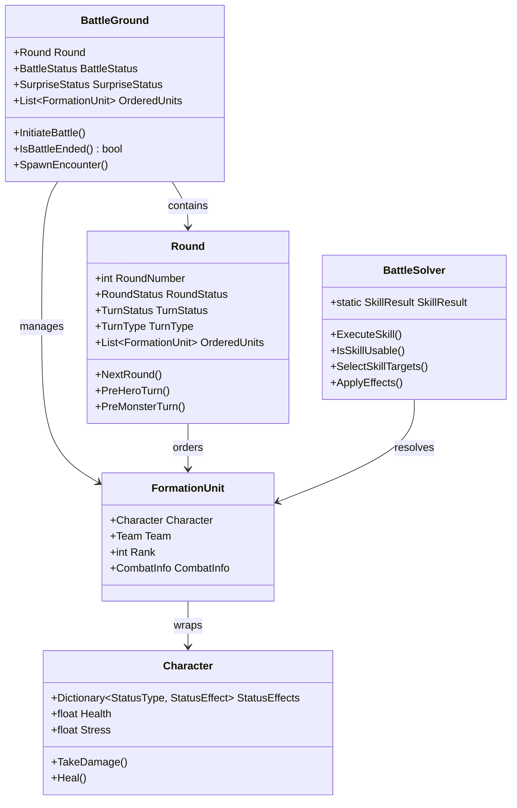
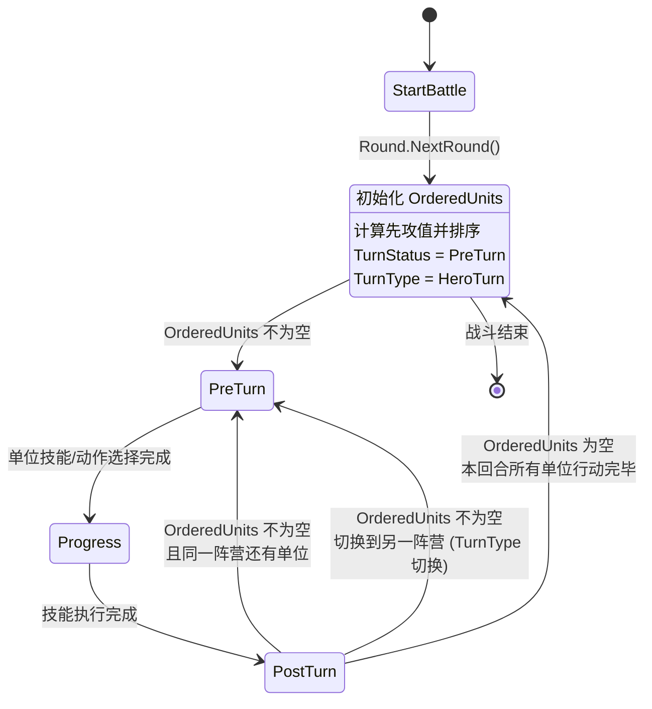
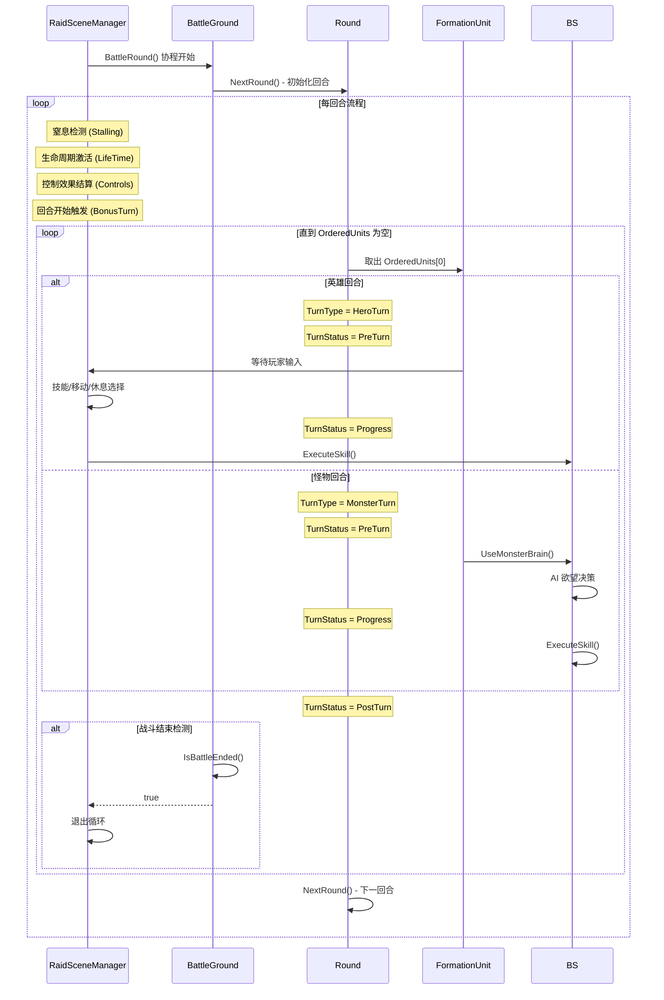
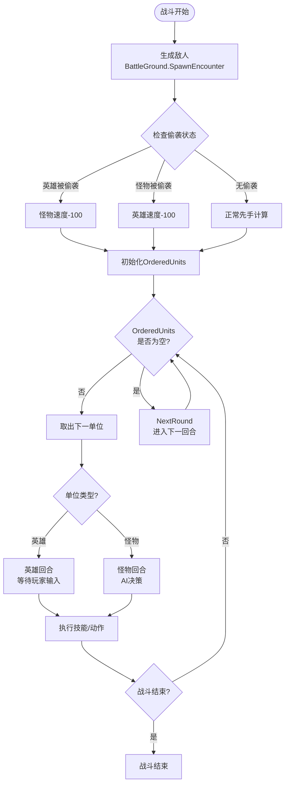
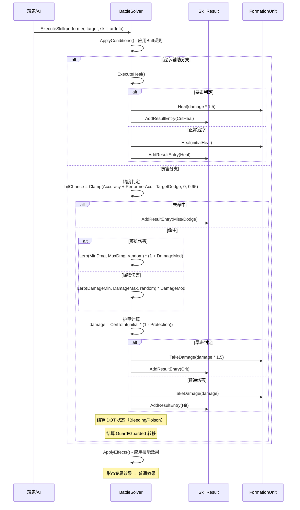
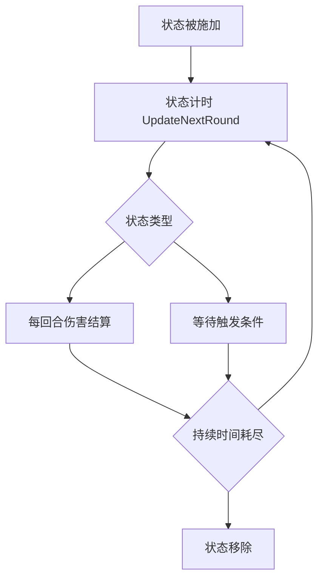
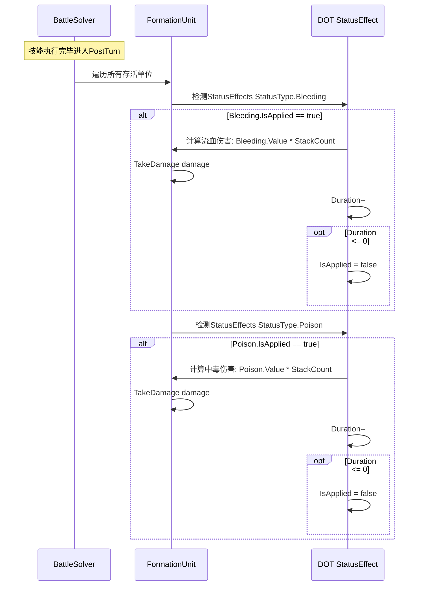
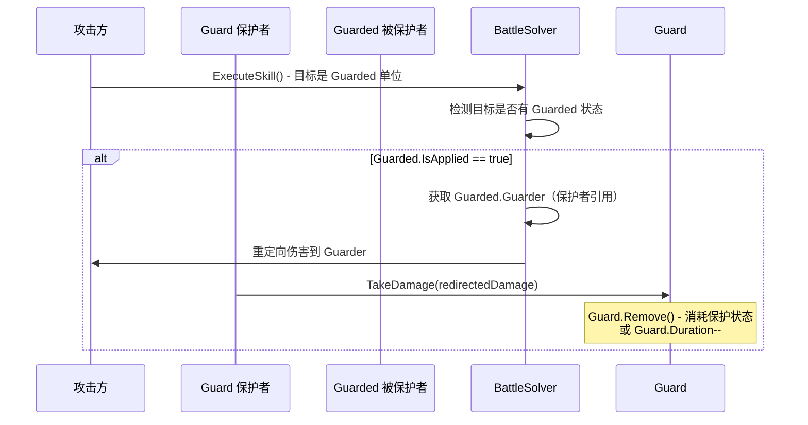
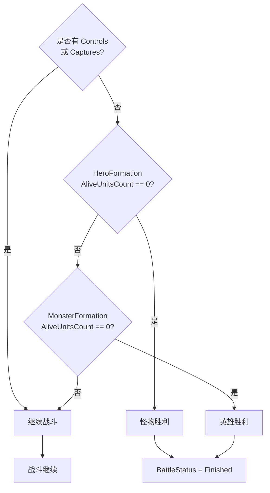
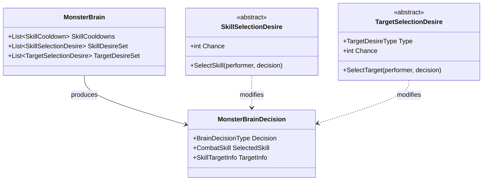

# Darkest Dungeon Unity 战斗机制深度技术文档

> **What/How/Why 解析法说明**
> - **What**: 该系统/组件是什么，解决什么问题
> - **How**: 具体实现机制与数据流
> - **Why**: 设计决策的背景与权衡

本系统采用**回合制 (Turn-Based)** 战斗模式，核心逻辑围绕 `BattleGround` 战场管理、`Round` 回合调度和 `BattleSolver` 技能结算三大支柱展开。通过数据驱动的技能定义和基于欲望（Desire）的 AI 决策，实现了高度灵活且可配置的回合制战斗体验。

---

## 目录

1. [核心数据结构](#1-核心数据结构)
2. [战斗流程总览](#2-战斗流程总览)
3. [行动顺序系统](#3-行动顺序系统)
4. [技能选择与目标确定](#4-技能选择与目标确定)
5. [伤害结算流程](#5-伤害结算流程)
6. [状态效果系统](#6-状态效果系统)
7. [战斗结束判定](#7-战斗结束判定)
8. [AI 决策机制](#8-ai-决策机制)
9. [关键文件索引](#9-关键文件索引)

---

## 1. 核心数据结构

### 1.0 战斗系统整体架构



---

### 1.1 战场状态枚举

```csharp
// 战斗状态
public enum BattleStatus { Peace, Fighting, Finished }

// 回合状态
public enum RoundStatus { Start, Progress, Finish }

// 回合内状态
public enum TurnStatus { PreTurn, Progress, PostTurn }

// 行动者类型
public enum TurnType { HeroTurn, MonsterTurn }

// 偷袭状态
public enum SurpriseStatus { Nothing, MonstersSurprised, HeroesSurprised }

// 队伍
public enum Team { Heroes, Monsters }
```

---

### 1.2 `BattleGround` - 战场管理器

**What:** 战斗的核心容器，管理所有战斗状态、队伍信息和回合调度。

**How:**

```csharp
public class BattleGround : MonoBehaviour
{
    public BattleFormation HeroFormation { get; }
    public BattleFormation MonsterFormation { get; }
    public FormationParty HeroParty { get; }
    public FormationParty MonsterParty { get; }

    public BattleStatus BattleStatus { get; set; }
    public SurpriseStatus SurpriseStatus { get; private set; }
    public Round Round { get; private set; }

    public int HeroNumber { get; }
    public int MonsterNumber { get; }
    public int MarkedHeroes { get; }
    public int VirtuedHeroes { get; }
    public int ControlCount { get; }

    public List<CompanionRecord> Companions { get; }
    public List<CaptureRecord> Captures { get; }
    public List<ControlRecord> Controls { get; }
    public List<LootDefinition> BattleLoot { get; }
}
```

**关键职责：**
- 战斗初始化 (`InitiateBattle`)
- 敌人生成 (`SpawnEncounter`)
- 战斗结束判定 (`IsBattleEnded`)
- 单位管理（捕获、控制、召唤）

---

### 1.3 `Round` - 回合调度器

**What:** 管理回合生命周期、行动顺序队列和状态转换。

**How:**

```csharp
public class Round
{
    public int RoundNumber { get; set; }
    public RoundStatus RoundStatus { get; set; }
    public TurnType TurnType { get; set; }
    public TurnStatus TurnStatus { get; set; }
    public List<FormationUnit> OrderedUnits { get; private set; }

    // 英雄回合控制
    public HeroTurnAction HeroAction { get; set; }
    public FormationUnit SelectedUnit { get; set; }
    public FormationUnit SelectedTarget { get; set; }
}
```

**回合生命周期（状态机）：**

`TurnStatus` 枚举定义：`{ PreTurn, Progress, PostTurn }`



**状态转换触发条件详解：**

| 当前状态 | 转换条件 | 下一状态 | 说明 |
|----------|----------|----------|------|
| `PreTurn` | 单位已完成技能/动作选择 | `Progress` | 进入技能执行阶段 |
| `Progress` | 技能效果结算完毕 | `PostTurn` | 结算后处理（如 DOT 伤害） |
| `PostTurn` | `OrderedUnits` 还有同阵营单位 | `PreTurn` | 继续处理下一单位 |
| `PostTurn` | `OrderedUnits` 为空 | `RoundStart` | 本回合结束，调用 `NextRound()` |
| `PostTurn` | 同阵营单位已全部行动完毕，但 `OrderedUnits` 还有他阵营单位 | `PreTurn` | `TurnType` 切换到另一阵营 |

---

## 2. 战斗流程总览

### 2.1 主循环入口：`BattleRound` 协程

战斗的核心循环位于 `RaidSceneManager.BattleRound` 协程：



### 2.2 回合初始化流程 (`NextRound`)

```csharp
public int NextRound(BattleGround battleground)
{
    RoundStatus = RoundStatus.Start;
    OrderedUnits.Clear();

    // Round 1 前置Buff处理
    if (RoundNumber == 0 || RoundNumber == 1)
    {
        battleground.HeroFormation.UpdateBuffRule(BuffRule.FirstRound);
        battleground.MonsterFormation.UpdateBuffRule(BuffRule.FirstRound);
    }

    // 将所有存活单位加入行动队列
    foreach (var unit in battleground.HeroParty.Units)
    {
        unit.CombatInfo.UpdateNextRound();
        OrderedUnits.Add(unit);
    }

    foreach (var unit in battleground.MonsterParty.Units)
    {
        unit.CombatInfo.UpdateNextRound();
        // 怪物根据 NumberOfTurns 可能有多个行动
        if (unit.Character.IsMonster)
            for (int i = 0; i < unit.Character.Initiative.NumberOfTurns; i++)
                OrderedUnits.Add(unit);
        else
            OrderedUnits.Add(unit);
    }

    // 根据偷袭状态调整排序
    if (RoundNumber == 0)
    {
        if (SurpriseStatus == HeroesSurprised)
            // 英雄速度 -100，确保怪物先手
        else if (SurpriseStatus == MonstersSurprised)
            // 怪物速度 -100（如果可被惊吓）
        else
            // 正常排序
    }
    else
        // 正常速度排序

    return ++RoundNumber;
}
```

### 2.3 战斗流程状态图



---

## 3. 行动顺序系统

### 3.1 先攻值计算

**公式：**
```
最终先攻 = Speed + Random(0, 3) + RandomDouble()
```

**关键代码：**
```csharp
// Round.cs - NextRound() 中的排序逻辑
OrderedUnits = new List<FormationUnit>(OrderedUnits.OrderByDescending(unit =>
    unit.Character.Speed + RandomSolver.Next(0, 3) + RandomSolver.NextDouble()));
```

### 3.2 偷袭惩罚

| 偷袭情况 | 受影响方 | 惩罚值 |
|----------|----------|--------|
| 英雄被偷袭 | 英雄 | Speed - 100 |
| 怪物被偷袭（可被惊吓） | 怪物 | Speed - 100 |

**关键代码：**
```csharp
if (RaidSceneManager.BattleGround.SurpriseStatus == SurpriseStatus.HeroesSurprised)
{
    OrderedUnits = new List<FormationUnit>(OrderedUnits.OrderByDescending(unit =>
        unit.Character.IsMonster ?
        unit.Character.Speed + RandomSolver.Next(0, 3) + RandomSolver.NextDouble() :
        unit.Character.Speed + RandomSolver.Next(0, 3) + RandomSolver.NextDouble() - 100));  // 英雄-100
}
```

### 3.3 怪物多回合机制

某些怪物拥有 `NumberOfTurns > 1`，会在同一回合内获得多次行动机会：

```csharp
// Round.cs - NextRound()
if (unit.Character.IsMonster)
    for (int i = 0; i < unit.Character.Initiative.NumberOfTurns; i++)
        OrderedUnits.Add(unit);  // 同一单位多次加入队列
```

### 3.4 临时插入机制

战斗过程中可以插入新的行动（如召唤物）：

```csharp
public void InsertInitiativeRoll(FormationUnit unit)
{
    // 按速度插入到合适位置
    for (int i = 0; i < OrderedUnits.Count; i++)
    {
        if (OrderedUnits[i].Character.Speed < unit.Character.Speed - 2)
        {
            OrderedUnits.Insert(i, unit);
            return;
        }
    }
    OrderedUnits.Add(unit);
}
```

---

## 4. 技能选择与目标确定

### 4.1 技能可用性检测

```csharp
public static bool IsSkillUsable(FormationUnit performer, CombatSkill skill)
{
    FormationParty friends;
    FormationParty enemies;
    if (performer.Team == Team.Heroes)
    {
        friends = RaidSceneManager.BattleGround.HeroParty;
        enemies = RaidSceneManager.BattleGround.MonsterParty;
    }
    else
    {
        friends = RaidSceneManager.BattleGround.MonsterParty;
        enemies = RaidSceneManager.BattleGround.HeroParty;
    }

    // 检测施法者站位是否在 LaunchRanks 内
    return skill.LaunchRanks.IsLaunchableFrom(performer.Rank, performer.Size) &&
        skill.HasAvailableTargets(performer, friends, enemies);
}
```

### 4.2 目标选择逻辑

```csharp
public static SkillTargetInfo SelectSkillTargets(FormationUnit performer,
    FormationUnit primaryTarget, CombatSkill skill)
{
    // 自定义技能 - 仅目标自己
    if (skill.TargetRanks.IsSelfTarget)
        return new SkillTargetInfo(performer, SkillTargetType.Self);

    // 友方技能
    if (skill.TargetRanks.IsSelfFormation)
    {
        if (skill.TargetRanks.IsMultitarget)
        {
            var targets = performer.Team == Team.Heroes ?
                new List<FormationUnit>(RaidSceneManager.BattleGround.HeroParty.Units) :
                new List<FormationUnit>(RaidSceneManager.BattleGround.MonsterParty.Units);

            if (!skill.IsSelfValid)
                targets.Remove(performer);

            return new SkillTargetInfo(targets, SkillTargetType.Party);
        }
        else
            return new SkillTargetInfo(primaryTarget, SkillTargetType.Party);
    }
    else  // 敌方技能
    {
        if (skill.TargetRanks.IsMultitarget)
        {
            var targets = performer.Team == Team.Heroes ?
                new List<FormationUnit>(RaidSceneManager.BattleGround.MonsterParty.Units) :
                new List<FormationUnit>(RaidSceneManager.BattleGround.HeroParty.Units);

            return new SkillTargetInfo(targets, SkillTargetType.Enemy);
        }
        else
            return new SkillTargetInfo(primaryTarget, SkillTargetType.Enemy);
    }
}
```

### 4.3 目标类型枚举

```csharp
public enum SkillTargetType
{
    Self,      // 仅自己
    Party,     // 友方（单体或全体）
    Enemy      // 敌方（单体或全体）
}
```

---

## 5. 伤害结算流程

### 5.1 完整结算时序



**伤害分支闭合说明：**

伤害分支的闭合点位于 `ExecuteSkill` 方法的最后，所有伤害计算完成后的统一出口：

1. 命中判定分支闭合（Miss/Dodge 或 命中）
2. 命中后伤害计算分支闭合（英雄/怪物伤害）
3. 暴击判定分支闭合（暴击/普通伤害）
4. DOT 状态和 Guard 转移在主分支内作为后处理结算

### 5.2 命中判定

**公式：**
```
命中率 = Clamp(技能精度 + 施法者精度 - 目标闪避, 0, 0.95)
```

**代码实现：**
```csharp
float accuracy = skill.Accuracy + performer.Accuracy;
float hitChance = Mathf.Clamp(accuracy - target.Dodge, 0, 0.95f);
float roll = (float)RandomSolver.NextDouble();

// 检测不可被命中修饰
if (target.BattleModifiers != null && target.BattleModifiers.CanBeHit == false)
    roll = float.MaxValue;

if (roll > hitChance)
{
    if (!(skill.CanMiss == false ||
          (target.BattleModifiers != null && target.BattleModifiers.CanBeMissed == false)))
    {
        if (roll > Mathf.Min(accuracy, 0.95f))
            SkillResult.AddResultEntry(new SkillResultEntry(targetUnit, SkillResultType.Miss));
        else
            SkillResult.AddResultEntry(new SkillResultEntry(targetUnit, SkillResultType.Dodge));
        return;
    }
}
```

### 5.3 伤害计算

**英雄伤害公式：**
```
初始伤害 = Lerp(MinDamage, MaxDamage, random) × (1 + SkillDamageMod)
```

**怪物伤害公式：**
```
初始伤害 = Lerp(SkillDamageMin, SkillDamageMax, random) × MonsterDamageMod
```

**护甲减免：**
```
最终伤害 = CeilToInt(初始伤害 × (1 - Protection))
```

**代码实现：**
```csharp
float initialDamage = performer is Hero ?
    Mathf.Lerp(performer.MinDamage, performer.MaxDamage,
        (float)RandomSolver.NextDouble()) * (1 + skill.DamageMod) :
    Mathf.Lerp(skill.DamageMin, skill.DamageMax,
        (float)RandomSolver.NextDouble()) * performer.DamageMod;

int damage = Mathf.CeilToInt(initialDamage * (1 - target.Protection));
if (damage < 0) damage = 0;

// 检测直接伤害豁免
if (target.BattleModifiers != null && target.BattleModifiers.CanBeDamagedDirectly == false)
    damage = 0;
```

### 5.4 暴击判定

**暴击伤害倍率：** 1.5 倍

**暴击率计算：**
```
暴击率 = PerformerCritChance + SkillCritMod
```

```csharp
if (skill.IsCritValid)
{
    float critChance = performer.GetSingleAttribute(AttributeType.CritChance).ModifiedValue + skill.CritMod;
    if (RandomSolver.CheckSuccess(critChance))
    {
        int critDamage = target.TakeDamage(damage * 1.5f);
        SkillResult.AddResultEntry(new SkillResultEntry(targetUnit, critDamage, SkillResultType.Crit));

        // 英雄暴击触发全队减压
        if (targetUnit.Character.IsMonster == false)
            DarkestDungeonManager.Data.Effects["Stress 2"].ApplyIndependent(targetUnit);
        return;
    }
}
```

### 5.5 伤害公式汇总

| 计算步骤 | 公式 | 说明 |
|----------|------|------|
| **命中判定** | `hitChance = Clamp(SkillAccuracy + PerformerAccuracy - TargetDodge, 0, 0.95)` | 上限 95% |
| **英雄伤害** | `Lerp(MinDmg, MaxDmg, random) * (1 + DamageMod)` | 角色属性区间 |
| **怪物伤害** | `Lerp(DamageMin, DamageMax, random) * DamageMod` | 技能固定区间 |
| **护甲减免** | `damage = CeilToInt(initialDamage * (1 - Protection))` | Protection 为 0-1 小数 |
| **暴击伤害** | `damage * 1.5` | 固定 1.5 倍 |

---

## 6. 状态效果系统

### 6.1 状态效果类型

战斗中的状态效果通过 `Character.StatusEffects` 字典管理：

```csharp
// Character.cs - InitializeBasicStatuses()
protected Dictionary<StatusType, StatusEffect> StatusEffects;

public static void InitializeBasicStatuses(Dictionary<StatusType, StatusEffect> targetDictionary)
{
    targetDictionary.Add(StatusType.Stun, new StunStatusEffect());
    targetDictionary.Add(StatusType.Marked, new MarkStatusEffect());
    targetDictionary.Add(StatusType.Riposte, new RiposteStatusEffect());
    targetDictionary.Add(StatusType.Bleeding, new BleedingStatusEffect());
    targetDictionary.Add(StatusType.Poison, new PoisonStatusEffect());
    targetDictionary.Add(StatusType.Guard, new GuardStatusEffect());
    targetDictionary.Add(StatusType.Guarded, new GuardedStatusEffect());
    targetDictionary.Add(StatusType.DeathsDoor, new DeathsDoorStatusEffect());
    targetDictionary.Add(StatusType.DeathRecovery, new DeathRecoveryStatusEffect());
}
```

### 6.2 状态效果分类

| 状态类型 | 说明 | 典型效果 |
|----------|------|----------|
| **Stun** | 眩晕 | 跳过下一次行动 |
| **Marked** | 标记 | AI 优先攻击被标记目标 |
| **Riposte** | 反击 | 受到攻击时自动反击 |
| **Bleeding** | 流血 | 每回合受到持续伤害 |
| **Poison** | 中毒 | 每回合受到持续伤害 |
| **Guard** | 保护 | 为指定目标承受攻击 |
| **Guarded** | 被保护 | 被指定目标保护 |
| **DeathsDoor** | 濒死 | HP为0时进入濒死状态 |
| **DeathRecovery** | 死亡恢复 | 濒死恢复中 |

### 6.3 状态效果访问

```csharp
// 通过索引器访问
var stunEffect = character[StatusType.Stun];

// 检测是否已应用
if (character[StatusType.Stun].IsApplied)
{
    // 单位被眩晕
}
```

### 6.4 状态效果完整生命周期

状态效果从施加到移除的完整生命周期如下：



#### 6.4.1 状态施加（Apply）

状态通过以下方式被施加：

**方式一：通过 `SubEffect.Apply()`**
```csharp
// SkillEffect.cs 或 SubEffect.cs
public void Apply(FormationUnit target, FormationUnit performer)
{
    target.Character[StatusType.Bleeding].Apply(bleedingDamage, duration);
}
```

**方式二：通过 `StatusEffect.Apply()` 直接调用**
```csharp
// Character.cs
public void ApplyStatusEffect(StatusType type, params object[] args)
{
    StatusEffects[type].Apply(args);
}
```

**施加时的核心逻辑：**
```csharp
// StatusEffect.cs - Apply() 伪代码
public virtual void Apply(params object[] args)
{
    if (!CanApply())
        return;

    IsApplied = true;
    Duration = GetInitialDuration(args);  // 从技能定义获取持续回合数
    StackCount = CalculateStack(args);     // 可叠加状态累加层数
    Value = CalculateValue(args);          // 状态效果值（如伤害值）
}
```

#### 6.4.2 状态计时（UpdateNextRound）

每回合开始时，调用 `UpdateNextRound()` 更新所有单位的状态计时：

```csharp
// CombatInfo.cs - UpdateNextRound()
public void UpdateNextRound()
{
    // 更新所有状态效果的持续时间
    foreach (var status in Character.StatusEffects.Values)
    {
        if (status.IsApplied)
            status.UpdateNextRound();
    }
}
```

```csharp
// StatusEffect.cs - UpdateNextRound() 伪代码
public virtual void UpdateNextRound()
{
    // 非 DOT 类状态：仅减少持续时间
    if (!IsDot)
        Duration--;

    // DOT 类状态：在每回合结束时结算伤害
    // 具体结算时机在技能效果完全执行后
}
```

#### 6.4.3 DOT 类状态每回合结算流程

DOT（Damage Over Time）类状态（Bleeding/Poison）在每回合**结束**时进行伤害结算：



**DOT 结算关键代码：**
```csharp
// BattleSolver.cs 或专门的状态结算阶段
public void ProcessDotEffects(FormationUnit target)
{
    var bleeding = target.Character[StatusType.Bleeding];
    if (bleeding.IsApplied)
    {
        int damage = (int)(bleeding.Value * bleeding.StackCount);
        target.TakeDamage(damage);
        bleeding.UpdateDuration();

        if (bleeding.Duration <= 0)
            bleeding.IsApplied = false;
    }

    var poison = target.Character[StatusType.Poison];
    if (poison.IsApplied)
    {
        int damage = (int)(poison.Value * poison.StackCount);
        target.TakeDamage(damage);
        poison.UpdateDuration();

        if (poison.Duration <= 0)
            poison.IsApplied = false;
    }
}
```

#### 6.4.4 状态移除

状态效果通过以下方式被移除：

| 移除方式 | 说明 | 触发时机 |
|----------|------|----------|
| **自然消退** | `Duration` 减至 0 | 每回合 `UpdateNextRound()` |
| **被清除** | 特定技能/效果移除状态 | 施放清除技能时 |
| **覆盖** | 同一 `StatusType` 被重新施加 | 新效果应用时重置 `IsApplied` |

```csharp
// StatusEffect.cs - 自然消退伪代码
public void UpdateDuration()
{
    Duration--;
    if (Duration <= 0)
    {
        IsApplied = false;
        ResetValue();  // 重置为默认值
    }
}
```

### 6.5 Guard / Guarded 保护链路协同机制

#### 6.5.1 机制概述

**Guard** 和 **Guarded** 是成对出现的保护状态：
- **Guard**（保护者）：主动为他人承受伤害的单位
- **Guarded**（被保护者）：被保护状态覆盖的单位

#### 6.5.2 保护链路建立

当技能效果触发保护状态时：

```csharp
// GuardStatusEffect.cs - Apply()
public void Apply(FormationUnit guarder, FormationUnit guardedTarget)
{
    // Guard 施加在保护者身上
    this.IsApplied = true;
    this.GuardedTarget = guardedTarget;  // 记录被保护目标

    // 在被保护者身上设置 Guarded 状态
    guardedTarget.Character[StatusType.Guarded].Apply(guarder);
}
```

#### 6.5.3 伤害转移流程



#### 6.5.4 结算顺序

**关键设计：Guard/Guarded 在伤害时序中的结算顺序**

1. 原始伤害计算完成（命中判定、伤害计算、暴击）
2. 检测目标是否被 Guarded
3. 如果 Guarded：伤害重定向到 Guarder
4. Guarder 承受伤害
5. Guard 状态消耗（持续时间减少或移除）

**代码实现：**
```csharp
// BattleSolver.cs - 伤害重定向伪代码
int finalDamage = CalculateDamage(performer, target, skill);

if (target.Character[StatusType.Guarded].IsApplied)
{
    var guarder = target.Character[StatusType.Guarded].Guarder;
    if (guarder != null && guarder.Character[StatusType.Guard].IsApplied)
    {
        // 伤害转移到保护者
        guarder.TakeDamage(finalDamage);

        // 消耗 Guard 状态
        guarder.Character[StatusType.Guard].Consume();

        // 记录到 SkillResult
        SkillResult.AddResultEntry(new SkillResultEntry(
            target, SkillResultType.DamageRedirected, guarder));
        return;
    }
}
```

### 6.6 战斗中的状态处理

```csharp
// BattleGround.cs - 眩晕检测
if (HeroParty.Units[i].Character[StatusType.Stun].IsApplied)
    HeroParty.Units[i].SetHalo("stunned");

// 怪物被惊吓
if (MonsterParty.Units[i].CombatInfo.IsSurprised)
    MonsterParty.Units[i].SetHalo("surprised");

//  immobilize 检测
if (HeroParty.Units[i].CombatInfo.IsImmobilized)
    HeroParty.Units[i].SetDefendAnimation(true);
```

---

## 7. 战斗结束判定

### 7.1 结束条件

```csharp
public bool IsBattleEnded()
{
    // 控制/捕获状态下不能结束
    if (Controls.Count != 0 || Captures.Count != 0)
        return false;

    // 任意一方全灭
    if (HeroFormation.AliveUnitsCount == 0 ||
        MonsterFormation.AliveUnitsCount == 0 ||
        BattleStatus == BattleStatus.Finished)
    {
        BattleStatus = BattleStatus.Finished;
        return true;
    }
    return false;
}
```

### 7.2 结束判定流程



---

## 8. AI 决策机制

### 8.1 怪物AI架构



### 8.2 AI 决策流程

```csharp
public static MonsterBrainDecision UseMonsterBrain(FormationUnit performer, string combatSkillOverride = null)
{
    var monster = performer.Character as Monster;

    if (string.IsNullOrEmpty(combatSkillOverride))
    {
        var skillDesires = new List<SkillSelectionDesire>(monster.Brain.SkillDesireSet);
        var monsterBrainDecision = new MonsterBrainDecision(BrainDecisionType.Pass);

        while (skillDesires.Count != 0)
        {
            // 随机选择欲望
            SkillSelectionDesire desire = RandomSolver.ChooseByRandom(skillDesires);
            if (desire != null && desire.SelectSkill(performer, monsterBrainDecision))
            {
                // 应用冷却
                var cooldown = monster.Brain.SkillCooldowns
                    .Find(cd => cd.SkillId == monsterBrainDecision.SelectedSkill.Id);
                if (cooldown != null)
                    performer.CombatInfo.SkillCooldowns.Add(cooldown.Copy());

                return monsterBrainDecision;
            }
            else
                skillDesires.Remove(desire);
        }
        return new MonsterBrainDecision(BrainDecisionType.Pass);
    }
    // ... override 逻辑
}
```

### 8.3 欲望系统 (Desire System)

**技能选择欲望：**
- `SkillSelectionRandom` - 随机选择
- `SkillSelectionPreferred` - 优先选择特定技能
- `SkillSelectionHeal` - HP低于阈值时治疗
- `SkillSelectionStatus` - 基于状态选择

**目标选择欲望：**
- `TargetSelectionRandom` - 随机目标
- `TargetSelectionHealth` - 选择HP最低/最高
- `TargetSelectionStress` - 选择压力最高
- `TargetSelectionRank` - 选择特定位置

---

## 9. 关键文件索引

| 文件路径 | 说明 |
|----------|------|
| `Assets/Scripts/Raid/Battle/BattleGround.cs` | 战场状态管理、战斗结束判定 |
| `Assets/Scripts/Mechanics/Battle/Round.cs` | 回合调度、行动顺序 |
| `Assets/Scripts/Mechanics/Battle/BattleSolver.cs` | 伤害结算、技能执行 |
| `Assets/Scripts/Managers/RaidSceneManager.cs` | 主战斗循环 BattleRound |
| `Assets/Scripts/Character/Character.cs` | 状态效果管理 |
| `Assets/Scripts/Character/Statuses/StatusEffect.cs` | 状态效果基类 |
| `Assets/Scripts/Mechanics/Battle/SkillResult.cs` | 技能结果容器 |
| `Assets/Scripts/Mechanics/Battle/SkillTargetInfo.cs` | 目标选择信息 |
| `Assets/Scripts/Mechanics/AI/MonsterBrain.cs` | 怪物AI脑 |

---

## 本次文档扩写查阅的核心文件/类名清单

1. **BattleGround.cs** - 战场管理器，战斗状态、偷袭检测、结束判定
2. **Round.cs** - 回合调度器，OrderedUnits 排序，先攻值计算
3. **BattleSolver.cs** - 战斗结算器，伤害计算、暴击判定、效果应用
4. **RaidSceneManager.cs** - BattleRound 协程，战斗主循环
5. **Character.cs** - StatusEffects 字典，状态效果访问
6. **StatusEffect.cs** - 状态效果基类定义
7. **SkillResult.cs** - 技能结果类型（Hit/Miss/Crit/Dodge等）
8. **SkillTargetInfo.cs** - 目标选择结果

---

[返回主页](Index.md)
